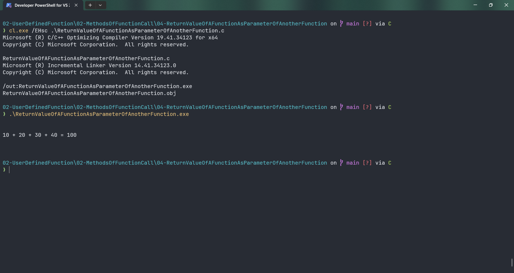

# ReturnValueOfAFunctionAsParameterOfAnotherFunction

Submitted by Yash Pravin Pawar (RTR2024-023)

## Output Screenshots


## Code
### [ReturnValueOfAFunctionAsParameterOfAnotherFunction.c](./01-Code/ReturnValueOfAFunctionAsParameterOfAnotherFunction.c)
```c
#include <stdio.h>

int main(int argc, char *argv[], char *envp[])
{
    int MyAddition(int, int);

    int ypp_r;
    int ypp_num_01, ypp_num_02;
    int ypp_num_03, ypp_num_04;

    ypp_num_01 = 10;
    ypp_num_02 = 20;
    ypp_num_03 = 30;
    ypp_num_04 = 40;

    ypp_r = MyAddition(MyAddition(ypp_num_01, ypp_num_02), MyAddition(ypp_num_03, ypp_num_04));

    printf("\n\n");
    printf("%d + %d + %d + %d = %d\n", ypp_num_01, ypp_num_02, ypp_num_03, ypp_num_04, ypp_r);
    printf("\n\n");

    return (0);
}

int MyAddition(int a, int b)
{
    int sum;

    sum = a + b;
    return (sum);
}

```
