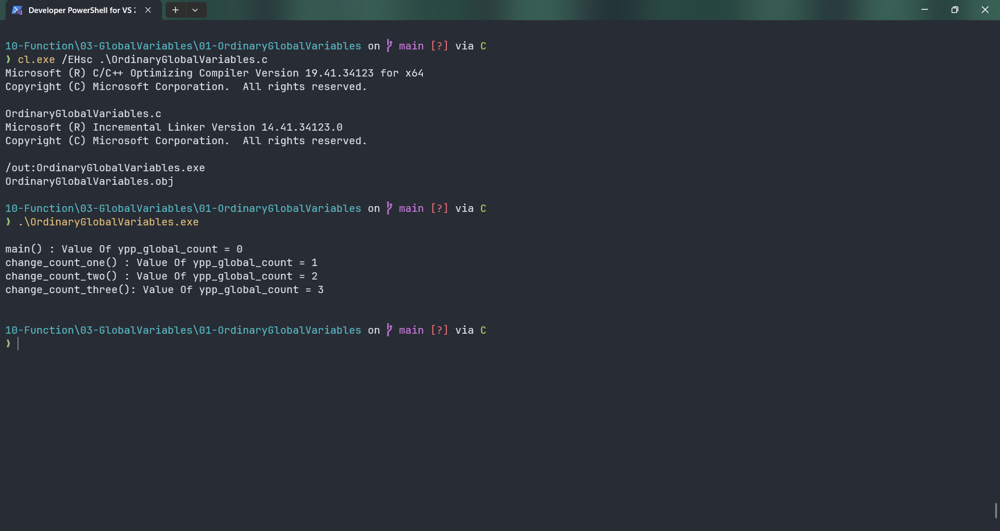

# OrdinaryGlobalVariables

Submitted by Yash Pravin Pawar (RTR2024-023)

## Output Screenshots


## Code
### [OrdinaryGlobalVariables.c](./01-Code/OrdinaryGlobalVariables.c)
```c
#include <stdio.h>

int ypp_global_count = 0;

int main(void)
{
    void change_count_one(void);
    void change_count_two(void);
    void change_count_three(void);

    printf("\n");

    printf("main() : Value Of ypp_global_count = %d\n", ypp_global_count);

    change_count_one();
    change_count_two();
    change_count_three();

    printf("\n");

    return (0);
}

void change_count_one(void)
{
    ypp_global_count = ypp_global_count + 1;

    printf("change_count_one() : Value Of ypp_global_count = %d\n", ypp_global_count);
}

void change_count_two(void)
{
    ypp_global_count = ypp_global_count + 1;

    printf("change_count_two() : Value Of ypp_global_count = %d\n", ypp_global_count);
}

void change_count_three(void)
{
    ypp_global_count = ypp_global_count + 1;

    printf("change_count_three(): Value Of ypp_global_count = %d\n", ypp_global_count);
}

```
