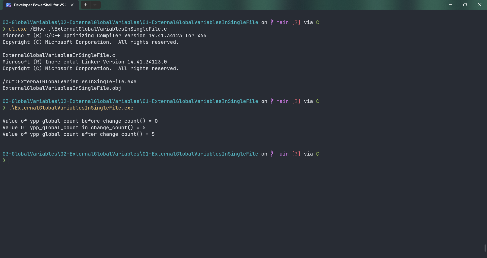

# ExternalGlobalVariablesInSingleFile

Submitted by Yash Pravin Pawar (RTR2024-023)

## Output Screenshots


## Code
### [ExternalGlobalVariablesInSingleFile.c](./01-Code/ExternalGlobalVariablesInSingleFile.c)
```c
#include <stdio.h>

int main(void)
{
    void change_count(void);

    extern int ypp_global_count;

    printf("\n");
    printf("Value of ypp_global_count before change_count() = %d\n", ypp_global_count);

    change_count();

    printf("Value of ypp_global_count after change_count() = %d\n", ypp_global_count);

    printf("\n");

    return (0);
}

int ypp_global_count = 0;

void change_count(void)
{
    ypp_global_count = 5;
    printf("Value Of ypp_global_count in change_count() = %d\n", ypp_global_count);
}

```
