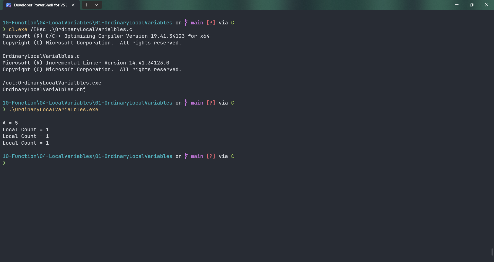

# OrdinaryLocalVarialbles

Submitted by Yash Pravin Pawar (RTR2024-023)

## Output Screenshots


## Code
### [OrdinaryLocalVarialbles.c](./01-Code/OrdinaryLocalVarialbles.c)
```c
#include <stdio.h>

int main(void)
{
    int ypp_a = 5;

    void change_count(void);

    printf("\n");
    printf("A = %d\n", ypp_a);

    change_count();

    change_count();

    change_count();

    return (0);
}

void change_count(void)
{
    int local_count = 0;

    local_count = local_count + 1;

    printf("Local Count = %d\n", local_count);
}

```
