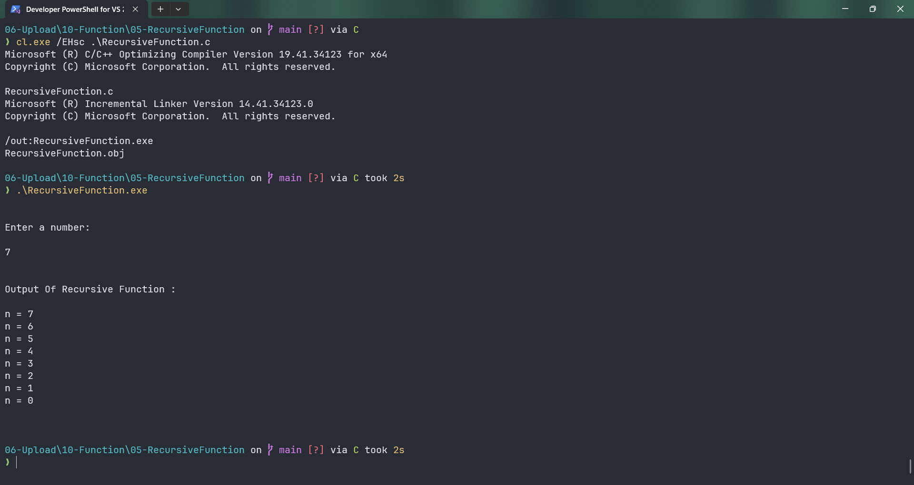

# RecursiveFunction

Submitted by Yash Pravin Pawar (RTR2024-023)

## Output Screenshots


## Code
### [RecursiveFunction.c](./01-Code/RecursiveFunction.c)
```c
#include <stdio.h>

int main(int argc, char *argv[], char *envp[])
{
    unsigned int ypp_num;

    void recursive(unsigned int);

    printf("\n\n");
    printf("Enter a number: \n\n");
    scanf("%u", &ypp_num);

    printf("\n\n");
    printf("Output Of Recursive Function : \n\n");

    recursive(ypp_num);

    printf("\n\n");

    return (0);
}

void recursive(unsigned int n)
{
    printf("n = %d\n", n);

    if (n > 0)
    {
        recursive(n - 1);
    }
}

```
