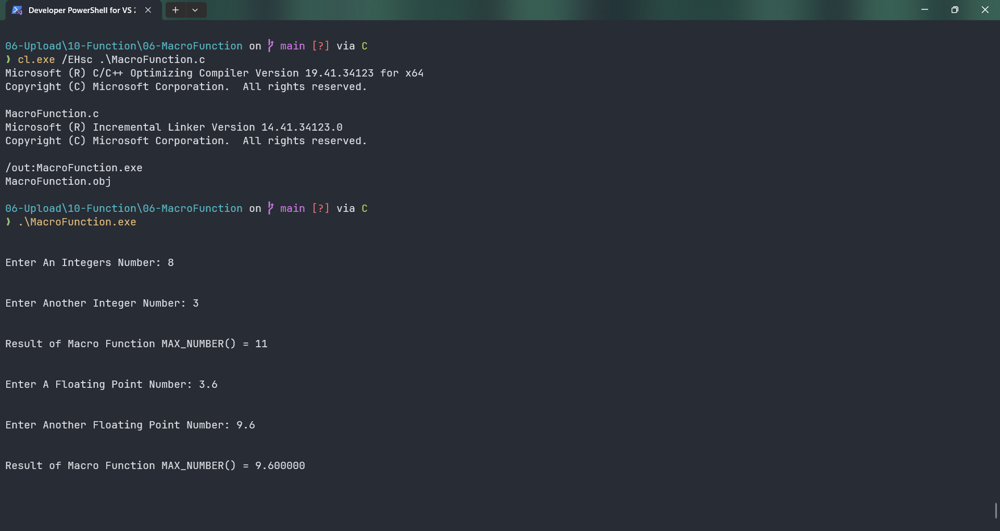

# MacroFunction

Submitted by Yash Pravin Pawar (RTR2024-023)

## Output Screenshots


## Code
### [MacroFunction.c](./01-Code/MacroFunction.c)
```c
#include <stdio.h>

#define MAX_NUMBER(a, b) ((a > b) ? a : b)

int main(int argc, char *argv[], char *envp[])
{
    int ypp_iNum_01;
    int ypp_iNum_02;
    int ypp_iResult;

    float ypp_fNum_01;
    float ypp_fNum_02;
    float ypp_fResult;

    printf("\n\n");
    printf("Enter An Integers Number: ");
    scanf("%d", &ypp_iNum_01);

    printf("\n\n");
    printf("Enter Another Integer Number: ");
    scanf("%d", &ypp_iNum_02);

    ypp_iResult = ypp_iNum_01 + ypp_iNum_02;
    printf("\n\n");
    printf("Result of Macro Function MAX_NUMBER() = %d\n", ypp_iResult);

    printf("\n\n");

    printf("Enter A Floating Point Number: ");
    scanf("%f", &ypp_fNum_01);

    printf("\n\n");
    printf("Enter Another Floating Point Number: ");
    scanf("%f", &ypp_fNum_02);

    ypp_fResult = MAX_NUMBER(ypp_fNum_01, ypp_fNum_02);
    printf("\n\n");
    printf("Result of Macro Function MAX_NUMBER() = %f\n", ypp_fResult);

    printf("\n\n");

    return (0);
}

```
