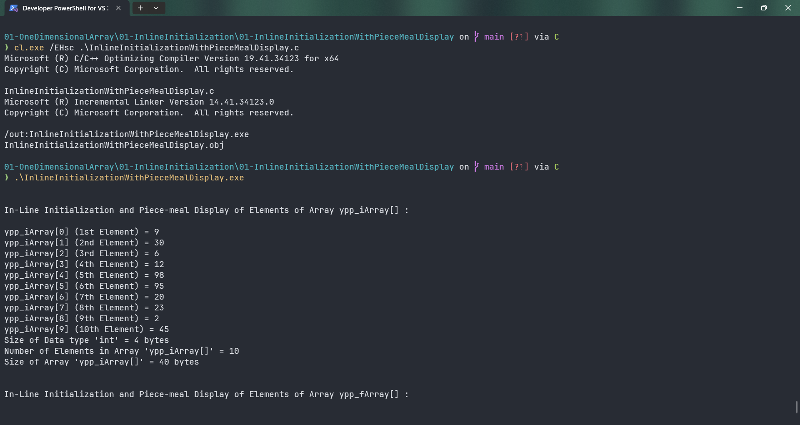
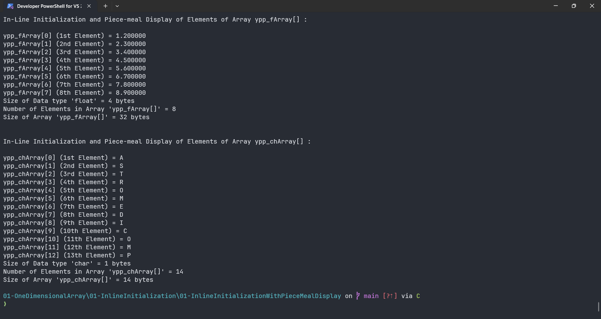

# InlineInitializationWithPieceMealDisplay

Submitted by Yash Pravin Pawar (RTR2024-023)

## Output Screenshots



## Code
### [InlineInitializationWithPieceMealDisplay.c](./01-Code/InlineInitializationWithPieceMealDisplay.c)
```c
#include <stdio.h>

int main(void)
{
    int ypp_iArray[] = { 9, 30, 6, 12, 98, 95, 20, 23, 2, 45 };
    int ypp_int_size;
    int ypp_iArray_size;
    int ypp_iArray_num_elements;

    float ypp_fArray[] = { 1.2f, 2.3f, 3.4f, 4.5f, 5.6f, 6.7f, 7.8f, 8.9f };
    int ypp_float_size;
    int ypp_fArray_size;
    int ypp_fArray_num_elements;

    char ypp_chArray[] = { 'A', 'S', 'T', 'R', 'O', 'M', 'E', 'D', 'I', 'C', 'O', 'M', 'P', '\0' };
    int ypp_char_size;
    int ypp_chArray_size;
    int ypp_chArray_num_elements;

    printf("\n\n");
    printf("In-Line Initialization and Piece-meal Display of Elements of Array ypp_iArray[] : \n\n");
    printf("ypp_iArray[0] (1st Element) = %d\n", ypp_iArray[0]);
    printf("ypp_iArray[1] (2nd Element) = %d\n", ypp_iArray[1]);
    printf("ypp_iArray[2] (3rd Element) = %d\n", ypp_iArray[2]);
    printf("ypp_iArray[3] (4th Element) = %d\n", ypp_iArray[3]);
    printf("ypp_iArray[4] (5th Element) = %d\n", ypp_iArray[4]);
    printf("ypp_iArray[5] (6th Element) = %d\n", ypp_iArray[5]);
    printf("ypp_iArray[6] (7th Element) = %d\n", ypp_iArray[6]);
    printf("ypp_iArray[7] (8th Element) = %d\n", ypp_iArray[7]);
    printf("ypp_iArray[8] (9th Element) = %d\n", ypp_iArray[8]);
    printf("ypp_iArray[9] (10th Element) = %d\n", ypp_iArray[9]);

    ypp_int_size = sizeof(int);
    ypp_iArray_size = sizeof(ypp_iArray);
    ypp_iArray_num_elements = ypp_iArray_size / ypp_int_size;
    printf("Size of Data type 'int' = %d bytes\n", ypp_int_size);
    printf("Number of Elements in Array 'ypp_iArray[]' = %d\n", ypp_iArray_num_elements);
    printf("Size of Array 'ypp_iArray[]' = %d bytes\n", ypp_iArray_size);

    printf("\n\n");
    printf("In-Line Initialization and Piece-meal Display of Elements of Array ypp_fArray[] : \n\n");
    printf("ypp_fArray[0] (1st Element) = %f\n", ypp_fArray[0]);
    printf("ypp_fArray[1] (2nd Element) = %f\n", ypp_fArray[1]);
    printf("ypp_fArray[2] (3rd Element) = %f\n", ypp_fArray[2]);
    printf("ypp_fArray[3] (4th Element) = %f\n", ypp_fArray[3]);
    printf("ypp_fArray[4] (5th Element) = %f\n", ypp_fArray[4]);
    printf("ypp_fArray[5] (6th Element) = %f\n", ypp_fArray[5]);
    printf("ypp_fArray[6] (7th Element) = %f\n", ypp_fArray[6]);
    printf("ypp_fArray[7] (8th Element) = %f\n", ypp_fArray[7]);

    ypp_float_size = sizeof(float);
    ypp_fArray_size = sizeof(ypp_fArray);
    ypp_fArray_num_elements = ypp_fArray_size / ypp_float_size;
    printf("Size of Data type 'float' = %d bytes\n", ypp_float_size);
    printf("Number of Elements in Array 'ypp_fArray[]' = %d\n", ypp_fArray_num_elements);
    printf("Size of Array 'ypp_fArray[]' = %d bytes\n", ypp_fArray_size);

    printf("\n\n");
    printf("In-Line Initialization and Piece-meal Display of Elements of Array ypp_chArray[] : \n\n");
    printf("ypp_chArray[0] (1st Element) = %c\n", ypp_chArray[0]);
    printf("ypp_chArray[1] (2nd Element) = %c\n", ypp_chArray[1]);
    printf("ypp_chArray[2] (3rd Element) = %c\n", ypp_chArray[2]);
    printf("ypp_chArray[3] (4th Element) = %c\n", ypp_chArray[3]);
    printf("ypp_chArray[4] (5th Element) = %c\n", ypp_chArray[4]);
    printf("ypp_chArray[5] (6th Element) = %c\n", ypp_chArray[5]);
    printf("ypp_chArray[6] (7th Element) = %c\n", ypp_chArray[6]);
    printf("ypp_chArray[7] (8th Element) = %c\n", ypp_chArray[7]);
    printf("ypp_chArray[8] (9th Element) = %c\n", ypp_chArray[8]);
    printf("ypp_chArray[9] (10th Element) = %c\n", ypp_chArray[9]);
    printf("ypp_chArray[10] (11th Element) = %c\n", ypp_chArray[10]);
    printf("ypp_chArray[11] (12th Element) = %c\n", ypp_chArray[11]);
    printf("ypp_chArray[12] (13th Element) = %c\n", ypp_chArray[12]);

    ypp_char_size = sizeof(char);
    ypp_chArray_size = sizeof(ypp_chArray);
    ypp_chArray_num_elements = ypp_chArray_size / ypp_char_size;
    printf("Size of Data type 'char' = %d bytes\n", ypp_char_size);
    printf("Number of Elements in Array 'ypp_chArray[]' = %d\n", ypp_chArray_num_elements);
    printf("Size of Array 'ypp_chArray[]' = %d bytes\n", ypp_chArray_size);

    return (0);
}

```
