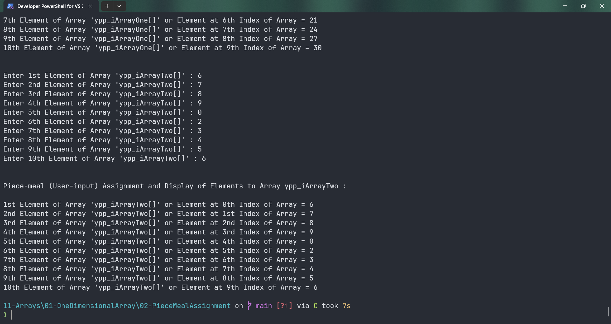
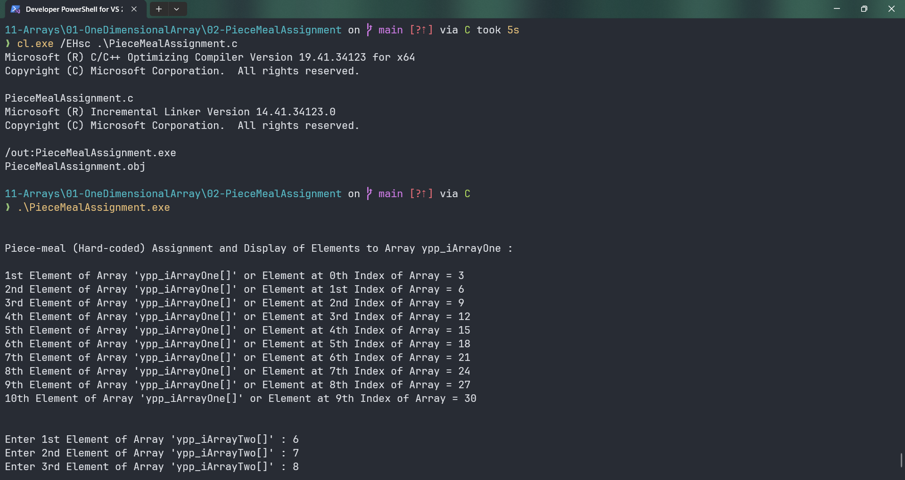

# PieceMealAssignment

Submitted by Yash Pravin Pawar (RTR2024-023)

## Output Screenshots



## Code
### [PieceMealAssignment.c](./01-Code/PieceMealAssignment.c)
```c
#include <stdio.h>

int main(void)
{
    int ypp_iArrayOne[10];
    int ypp_iArrayTwo[10];

    ypp_iArrayOne[0] = 3;
    ypp_iArrayOne[1] = 6;
    ypp_iArrayOne[2] = 9;
    ypp_iArrayOne[3] = 12;
    ypp_iArrayOne[4] = 15;
    ypp_iArrayOne[5] = 18;
    ypp_iArrayOne[6] = 21;
    ypp_iArrayOne[7] = 24;
    ypp_iArrayOne[8] = 27;
    ypp_iArrayOne[9] = 30;

    printf("\n\n");
    printf("Piece-meal (Hard-coded) Assignment and Display of Elements to Array ypp_iArrayOne : \n\n");
    printf("1st Element of Array 'ypp_iArrayOne[]' or Element at 0th Index of Array = %d\n", ypp_iArrayOne[0]);
    printf("2nd Element of Array 'ypp_iArrayOne[]' or Element at 1st Index of Array = %d\n", ypp_iArrayOne[1]);
    printf("3rd Element of Array 'ypp_iArrayOne[]' or Element at 2nd Index of Array = %d\n", ypp_iArrayOne[2]);
    printf("4th Element of Array 'ypp_iArrayOne[]' or Element at 3rd Index of Array = %d\n", ypp_iArrayOne[3]);
    printf("5th Element of Array 'ypp_iArrayOne[]' or Element at 4th Index of Array = %d\n", ypp_iArrayOne[4]);
    printf("6th Element of Array 'ypp_iArrayOne[]' or Element at 5th Index of Array = %d\n", ypp_iArrayOne[5]);
    printf("7th Element of Array 'ypp_iArrayOne[]' or Element at 6th Index of Array = %d\n", ypp_iArrayOne[6]);
    printf("8th Element of Array 'ypp_iArrayOne[]' or Element at 7th Index of Array = %d\n", ypp_iArrayOne[7]);
    printf("9th Element of Array 'ypp_iArrayOne[]' or Element at 8th Index of Array = %d\n", ypp_iArrayOne[8]);
    printf("10th Element of Array 'ypp_iArrayOne[]' or Element at 9th Index of Array = %d\n", ypp_iArrayOne[9]);

    printf("\n\n");
    printf("Enter 1st Element of Array 'ypp_iArrayTwo[]' : ");
    scanf("%d", &ypp_iArrayTwo[0]);
    printf("Enter 2nd Element of Array 'ypp_iArrayTwo[]' : ");
    scanf("%d", &ypp_iArrayTwo[1]);
    printf("Enter 3rd Element of Array 'ypp_iArrayTwo[]' : ");
    scanf("%d", &ypp_iArrayTwo[2]);
    printf("Enter 4th Element of Array 'ypp_iArrayTwo[]' : ");
    scanf("%d", &ypp_iArrayTwo[3]);
    printf("Enter 5th Element of Array 'ypp_iArrayTwo[]' : ");
    scanf("%d", &ypp_iArrayTwo[4]);
    printf("Enter 6th Element of Array 'ypp_iArrayTwo[]' : ");
    scanf("%d", &ypp_iArrayTwo[5]);
    printf("Enter 7th Element of Array 'ypp_iArrayTwo[]' : ");
    scanf("%d", &ypp_iArrayTwo[6]);
    printf("Enter 8th Element of Array 'ypp_iArrayTwo[]' : ");
    scanf("%d", &ypp_iArrayTwo[7]);
    printf("Enter 9th Element of Array 'ypp_iArrayTwo[]' : ");
    scanf("%d", &ypp_iArrayTwo[8]);
    printf("Enter 10th Element of Array 'ypp_iArrayTwo[]' : ");
    scanf("%d", &ypp_iArrayTwo[9]);

    printf("\n\n");
    printf("Piece-meal (User-input) Assignment and Display of Elements to Array ypp_iArrayTwo : \n\n");
    printf("1st Element of Array 'ypp_iArrayTwo[]' or Element at 0th Index of Array = %d\n", ypp_iArrayTwo[0]);
    printf("2nd Element of Array 'ypp_iArrayTwo[]' or Element at 1st Index of Array = %d\n", ypp_iArrayTwo[1]);
    printf("3rd Element of Array 'ypp_iArrayTwo[]' or Element at 2nd Index of Array = %d\n", ypp_iArrayTwo[2]);
    printf("4th Element of Array 'ypp_iArrayTwo[]' or Element at 3rd Index of Array = %d\n", ypp_iArrayTwo[3]);
    printf("5th Element of Array 'ypp_iArrayTwo[]' or Element at 4th Index of Array = %d\n", ypp_iArrayTwo[4]);
    printf("6th Element of Array 'ypp_iArrayTwo[]' or Element at 5th Index of Array = %d\n", ypp_iArrayTwo[5]);
    printf("7th Element of Array 'ypp_iArrayTwo[]' or Element at 6th Index of Array = %d\n", ypp_iArrayTwo[6]);
    printf("8th Element of Array 'ypp_iArrayTwo[]' or Element at 7th Index of Array = %d\n", ypp_iArrayTwo[7]);
    printf("9th Element of Array 'ypp_iArrayTwo[]' or Element at 8th Index of Array = %d\n", ypp_iArrayTwo[8]);
    printf("10th Element of Array 'ypp_iArrayTwo[]' or Element at 9th Index of Array = %d\n", ypp_iArrayTwo[9]);

    return (0);
}

```
