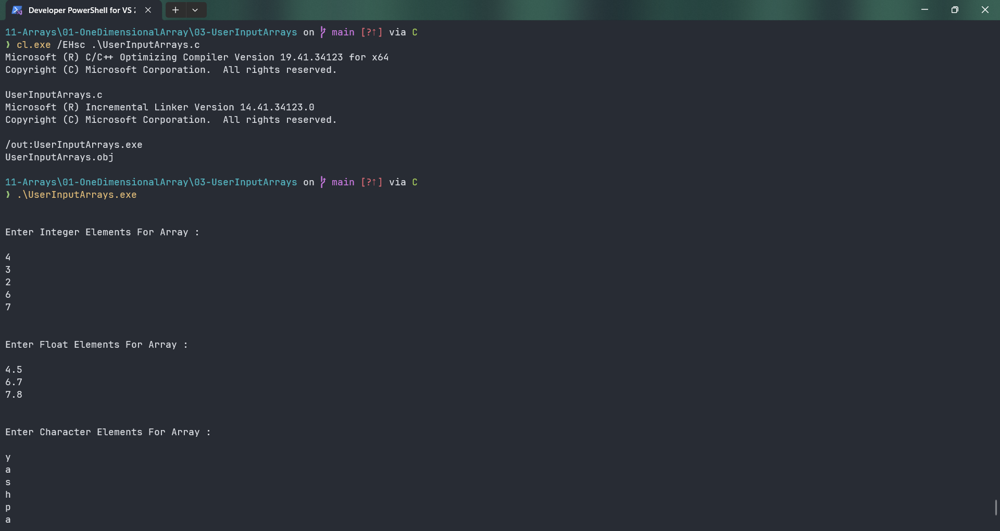
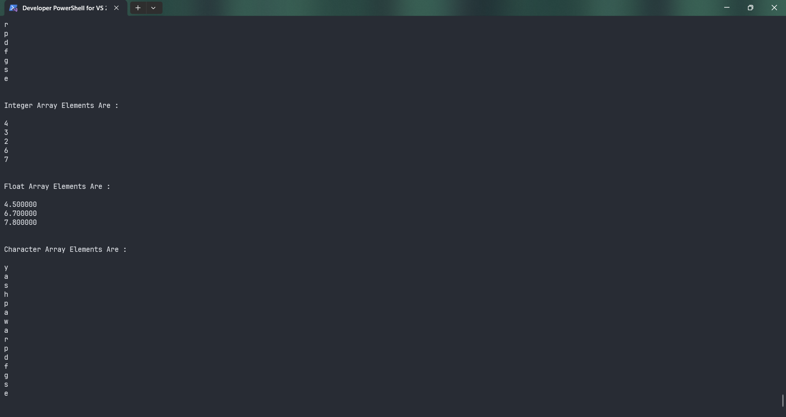

# UserInputArrays

Submitted by Yash Pravin Pawar (RTR2024-023)

## Output Screenshots



## Code
### [UserInputArrays.c](./01-Code/UserInputArrays.c)
```c
#include <stdio.h>

#define INT_ARRAY_NUM_ELEMENTS 5
#define FLOAT_ARRAY_NUM_ELEMENTS 3
#define CHAR_ARRAY_NUM_ELEMENTS 15

int main(void)
{
    int ypp_iArray[INT_ARRAY_NUM_ELEMENTS];
    float ypp_fArray[FLOAT_ARRAY_NUM_ELEMENTS];
    char ypp_chArray[CHAR_ARRAY_NUM_ELEMENTS];

    int i, num;

    // array element input
    printf("\n\n");
    printf("Enter Integer Elements For Array : \n\n");
    for (i = 0; i < INT_ARRAY_NUM_ELEMENTS; i++)
        scanf("%d", &ypp_iArray[i]);
    
    printf("\n\n");
    printf("Enter Float Elements For Array : \n\n");
    for (i = 0; i < FLOAT_ARRAY_NUM_ELEMENTS; i++)
        scanf("%f", &ypp_fArray[i]);

    printf("\n\n");
    printf("Enter Character Elements For Array : \n\n");
    for (i = 0; i < CHAR_ARRAY_NUM_ELEMENTS; i++)
        scanf(" %c", &ypp_chArray[i]);

    // array element output
    printf("\n\n");
    printf("Integer Array Elements Are : \n\n");
    for (i = 0; i < INT_ARRAY_NUM_ELEMENTS; i++)
        printf("%d\n", ypp_iArray[i]);

    printf("\n\n");
    printf("Float Array Elements Are : \n\n");
    for (i = 0; i < FLOAT_ARRAY_NUM_ELEMENTS; i++)
        printf("%f\n", ypp_fArray[i]);

    printf("\n\n");
    printf("Character Array Elements Are : \n\n");
    for (i = 0; i < CHAR_ARRAY_NUM_ELEMENTS; i++)
        printf("%c\n", ypp_chArray[i]);

    return (0);
}

```
