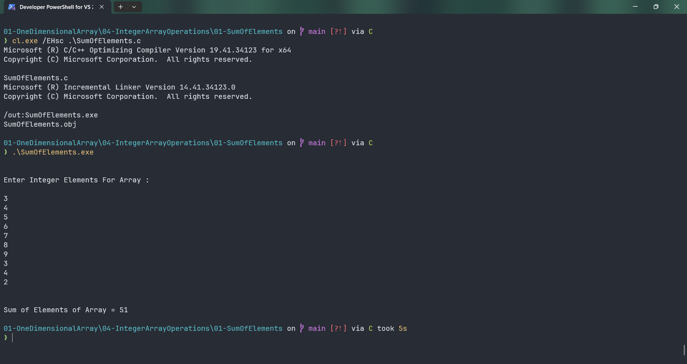

# SumOfElements

Submitted by Yash Pravin Pawar (RTR2024-023)

## Output Screenshots


## Code
### [SumOfElements.c](./01-Code/SumOfElements.c)
```c
#include <stdio.h>

#define NUM_ELEMENTS 10

int main(void)
{
    int ypp_iArray[NUM_ELEMENTS];
    int i, num, sum = 0;

    printf("\n\n");
    printf("Enter Integer Elements For Array : \n\n");

    for (i = 0; i < NUM_ELEMENTS; i++)
    {
        scanf("%d", &num);
        ypp_iArray[i] = num;
    }

    for (i = 0; i < NUM_ELEMENTS; i++)
    {
        sum += ypp_iArray[i];
    }

    printf("\n\n");
    printf("Sum of Elements of Array = %d\n", sum);

    return (0);
}

```
