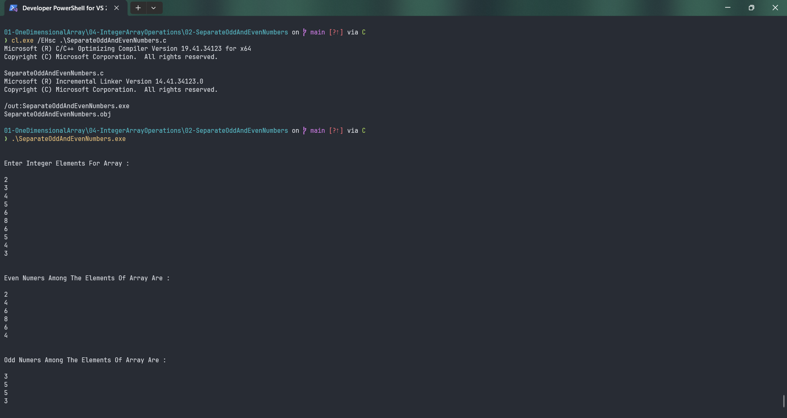

# SeparateOddAndEvenNumbers

Submitted by Yash Pravin Pawar (RTR2024-023)

## Output Screenshots


## Code
### [SeparateOddAndEvenNumbers.c](./01-Code/SeparateOddAndEvenNumbers.c)
```c
#include <stdio.h>

#define NUM_ELEMENTS 10

int main(void)
{
    int ypp_iArray[NUM_ELEMENTS];
    int i, num;

    printf("\n\n");

    printf("Enter Integer Elements For Array : \n\n");
    for (i = 0; i < NUM_ELEMENTS; i++)
    {
        scanf("%d", &num);
        ypp_iArray[i] = num;
    }

    printf("\n\n");
    printf("Even Numers Among The Elements Of Array Are : \n\n");
    for (i = 0; i < NUM_ELEMENTS; i++)
    {
        if ((ypp_iArray[i] % 2) == 0)
            printf("%d\n", ypp_iArray[i]);
    }

    printf("\n\n");
    printf("Odd Numers Among The Elements Of Array Are : \n\n");
    for (i = 0; i < NUM_ELEMENTS; i++)
    {
        if ((ypp_iArray[i] % 2) != 0)
            printf("%d\n", ypp_iArray[i]);
    }

    return (0);
}

```
