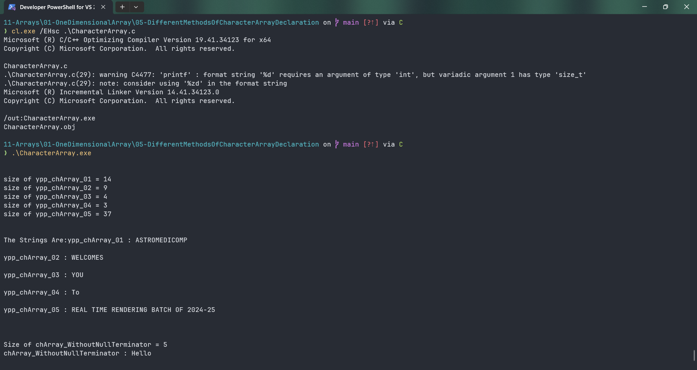

# CharacterArray

Submitted by Yash Pravin Pawar (RTR2024-023)

## Output Screenshots


## Code
### [CharacterArray.c](./01-Code/CharacterArray.c)
```c
#include <stdio.h>

int main(void)
{
    char ypp_chArray_01[] = { 'A', 'S', 'T', 'R', 'O', 'M', 'E', 'D', 'I', 'C', 'O', 'M', 'P', '\0' };
    char ypp_chArray_02[] = { 'W', 'E', 'L', 'C', 'O', 'M', 'E', 'S', '\0' };
    char ypp_chArray_03[] = { 'Y', 'O', 'U', '\0' };
    char ypp_chArray_04[] = "To";
    char ypp_chArray_05[] = "REAL TIME RENDERING BATCH OF 2024-25";

    char ypp_chArray_WithoutNullTerminator[] = { 'H', 'e', 'l', 'l', 'o' };

    printf("\n\n");
    printf("size of ypp_chArray_01 = %d\n", sizeof(ypp_chArray_01));
    printf("size of ypp_chArray_02 = %zd\n", sizeof(ypp_chArray_02));
    printf("size of ypp_chArray_03 = %zd\n", sizeof(ypp_chArray_03));
    printf("size of ypp_chArray_04 = %zd\n", sizeof(ypp_chArray_04));
    printf("size of ypp_chArray_05 = %zd\n", sizeof(ypp_chArray_05));

    printf("\n\n");
    printf("The Strings Are:");
    printf("ypp_chArray_01 : %s\n\n", ypp_chArray_01);
    printf("ypp_chArray_02 : %s\n\n", ypp_chArray_02);
    printf("ypp_chArray_03 : %s\n\n", ypp_chArray_03);
    printf("ypp_chArray_04 : %s\n\n", ypp_chArray_04);
    printf("ypp_chArray_05 : %s\n\n", ypp_chArray_05);

    printf("\n\n");
    printf("Size of chArray_WithoutNullTerminator = %d\n", sizeof(ypp_chArray_WithoutNullTerminator));
    printf("chArray_WithoutNullTerminator : %s\n", ypp_chArray_WithoutNullTerminator);

    return (0);
}

```
