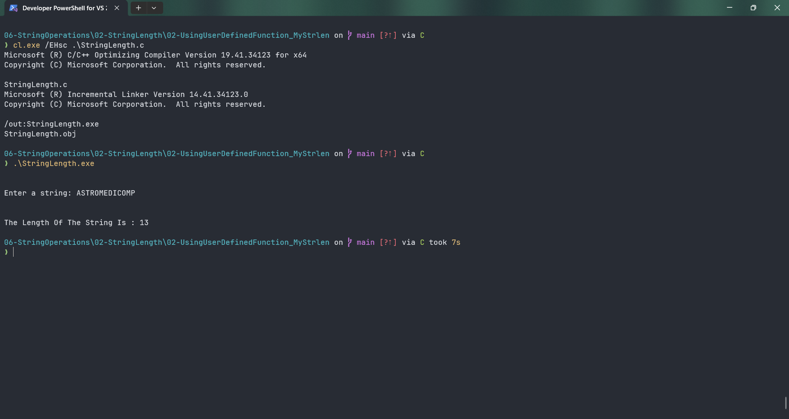

# StringLength

Submitted by Yash Pravin Pawar (RTR2024-023)

## Output Screenshots


## Code
### [StringLength.c](./01-Code/StringLength.c)
```c
#include <stdio.h>

#define MAX_STRING_LENGTH 512

int main(void)
{
    int MyStrlen(char[]);

    char ypp_chArray[MAX_STRING_LENGTH];
    int iStringLength = 0;

    printf("\n\n");
    printf("Enter a string: ");
    gets_s(ypp_chArray, MAX_STRING_LENGTH);

    printf("\n\n");
    iStringLength = MyStrlen(ypp_chArray);
    printf("The Length Of The String Is : %d\n", iStringLength);

    return (0);
}

int MyStrlen(char str[])
{
    int j;
    int string_length = 0;

    for (j = 0; j < MAX_STRING_LENGTH; j++)
    {
        if (str[j] == '\0')
            break;
        else
            string_length++;
    }

    return (string_length);
}

```
