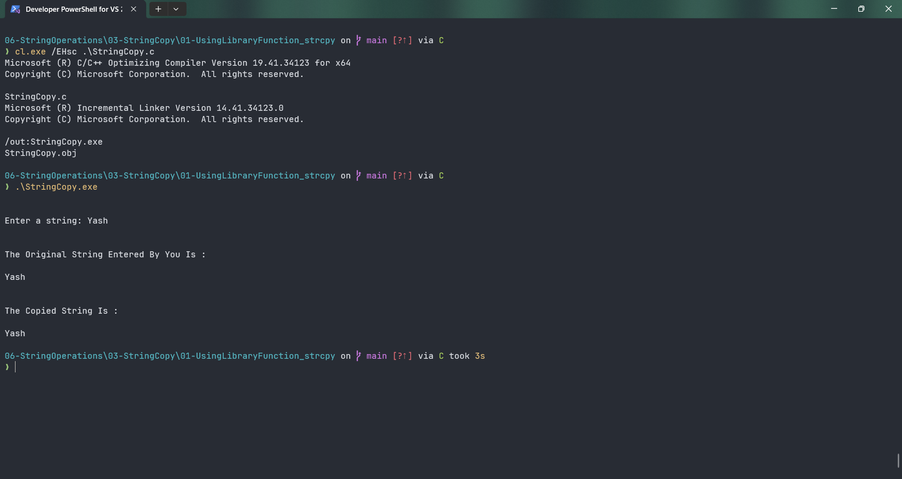

# StringCopy

Submitted by Yash Pravin Pawar (RTR2024-023)

## Output Screenshots


## Code
### [StringCopy.c](./01-Code/StringCopy.c)
```c
#include <stdio.h>
#include <string.h>

#define MAX_STRING_LENGTH 512

int main(void)
{
    char ypp_chArray_Original[MAX_STRING_LENGTH];
    char ypp_chArray_Copy[MAX_STRING_LENGTH];

    printf("\n\n");
    printf("Enter a string: ");
    gets_s(ypp_chArray_Original, MAX_STRING_LENGTH);

    strcpy(ypp_chArray_Copy, ypp_chArray_Original);

    printf("\n\n");
    printf("The Original String Entered By You Is : \n\n");
    printf("%s\n", ypp_chArray_Original);

    printf("\n\n");
    printf("The Copied String Is : \n\n");
    printf("%s\n", ypp_chArray_Copy);

    return (0);
}
```
