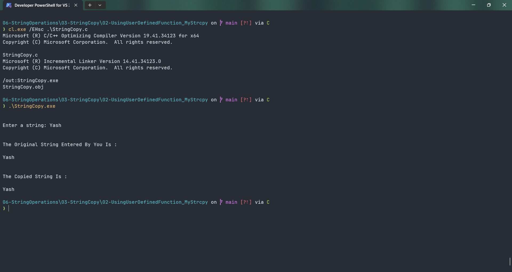

# StringCopy

Submitted by Yash Pravin Pawar (RTR2024-023)

## Output Screenshots


## Code
### [StringCopy.c](./01-Code/StringCopy.c)
```c
#include <stdio.h>

#define MAX_STRING_LENGTH 512

int main(void)
{
    void MyStrcpy(char[], char[]);

    char ypp_chArray_Original[MAX_STRING_LENGTH];
    char ypp_chArray_Copy[MAX_STRING_LENGTH];

    printf("\n\n");
    printf("Enter a string: ");
    gets_s(ypp_chArray_Original, MAX_STRING_LENGTH);

    MyStrcpy(ypp_chArray_Copy, ypp_chArray_Original);

    printf("\n\n");
    printf("The Original String Entered By You Is : \n\n");
    printf("%s\n", ypp_chArray_Original);

    printf("\n\n");
    printf("The Copied String Is : \n\n");
    printf("%s\n", ypp_chArray_Copy);

    return (0);
}

void MyStrcpy(char str_destination[], char str_source[])
{
    int MyStrlen(char[]);

    int iStringLength = 0;
    int j;

    iStringLength = MyStrlen(str_source);
    for (j = 0; j < iStringLength; j++)
        str_destination[j] = str_source[j];

    str_destination[j] = '\0';
}

int MyStrlen(char str[])
{
    int j;
    int string_length = 0;

    for (j = 0; j < MAX_STRING_LENGTH; j++)
    {
        if (str[j] == '\0')
            break;
        else
            string_length++;
    }

    return (string_length);
}

```
