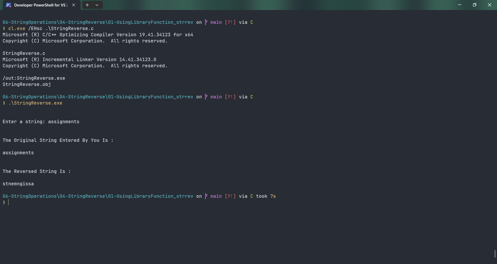

# StringReverse

Submitted by Yash Pravin Pawar (RTR2024-023)

## Output Screenshots


## Code
### [StringReverse.c](./01-Code/StringReverse.c)
```c
#include <stdio.h>
#include <string.h>

#define MAX_STRING_LENGTH 512

int main(void)
{
    char ypp_chArray[MAX_STRING_LENGTH];
    
    printf("\n\n");
    printf("Enter a string: ");
    gets_s(ypp_chArray, MAX_STRING_LENGTH);

    printf("\n\n");
    printf("The Original String Entered By You Is : \n\n");
    printf("%s\n", ypp_chArray);

    printf("\n\n");
    printf("The Reversed String Is : \n\n");
    printf("%s\n", strrev(ypp_chArray));

    return (0);
}

```
