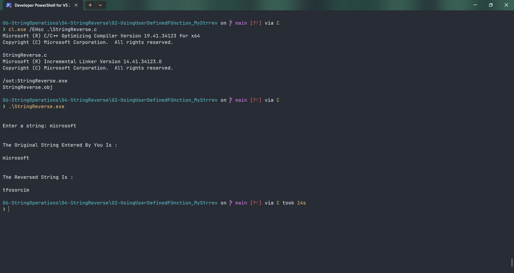

# StringReverse

Submitted by Yash Pravin Pawar (RTR2024-023)

## Output Screenshots


## Code
### [StringReverse.c](./01-Code/StringReverse.c)
```c
#include <stdio.h>

#define MAX_STRING_LENGTH 512

int main(void)
{
    void MyStrrev(char[], char[]);

    char ypp_chArray_original[MAX_STRING_LENGTH];
    char ypp_chArray_reversed[MAX_STRING_LENGTH];

    printf("\n\n");
    printf("Enter a string: ");
    gets_s(ypp_chArray_original, MAX_STRING_LENGTH);

    MyStrrev(ypp_chArray_reversed, ypp_chArray_original);

    printf("\n\n");
    printf("The Original String Entered By You Is : \n\n");
    printf("%s\n", ypp_chArray_original);

    printf("\n\n");
    printf("The Reversed String Is : \n\n");
    printf("%s\n", ypp_chArray_reversed);

    return (0);
}

void MyStrrev(char str_destination[], char str_source[])
{
    int MyStrlen(char[]);

    int iStringLength = 0;
    int i, j, len;

    iStringLength = MyStrlen(str_source);

    len = iStringLength - 1;

    for (i = 0, j = len; i < iStringLength, j >= 0; i++, j--)
        str_destination[i] = str_source[j];

    str_destination[i] = '\0';
}

int MyStrlen(char str[])
{
    int j;
    int string_length = 0;

    for (j = 0; j < MAX_STRING_LENGTH; j++)
    {
        if (str[j] == '\0')
            break;
        else
            string_length++;
    }

    return (string_length);
}

```
