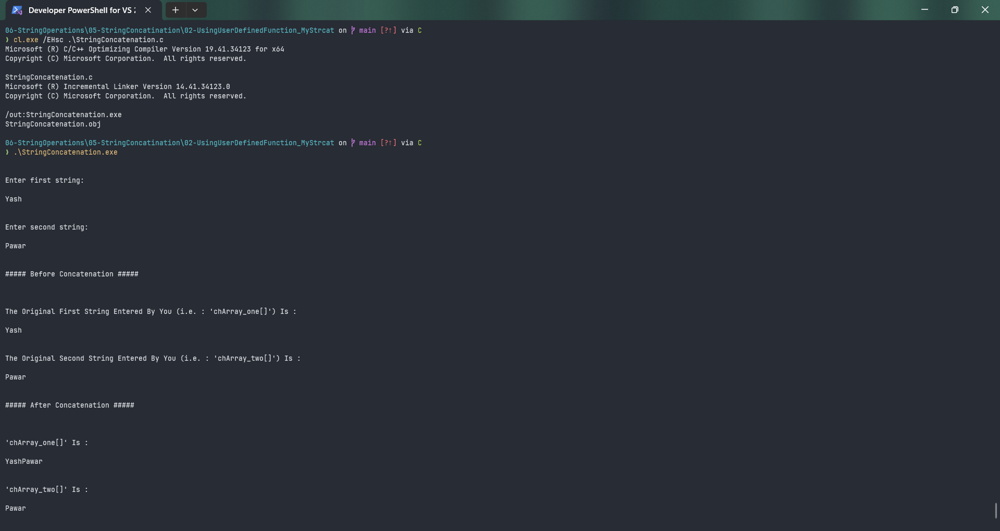

# StringConcatenation

Submitted by Yash Pravin Pawar (RTR2024-023)

## Output Screenshots


## Code
### [StringConcatenation.c](./01-Code/StringConcatenation.c)
```c
#include <stdio.h>

#define MAX_STRING_LENGTH 512

int main(void)
{
    void MyStrcat(char[], char[]);

    char ypp_chArray_one[MAX_STRING_LENGTH];
    char ypp_chArray_two[MAX_STRING_LENGTH];

    printf("\n\n");
    printf("Enter first string: \n\n");
    gets_s(ypp_chArray_one, MAX_STRING_LENGTH);

    printf("\n\n");
    printf("Enter second string: \n\n");
    gets_s(ypp_chArray_two, MAX_STRING_LENGTH);

    printf("\n\n");
    printf("##### Before Concatenation #####\n\n");
    printf("\n\n");
    printf("The Original First String Entered By You (i.e. : 'chArray_one[]') Is :\n\n");
    printf("%s\n", ypp_chArray_one);

    printf("\n\n");
    printf("The Original Second String Entered By You (i.e. : 'chArray_two[]') Is :\n\n");
    printf("%s\n", ypp_chArray_two);

    MyStrcat(ypp_chArray_one, ypp_chArray_two);

    printf("\n\n");
    printf("##### After Concatenation #####\n\n");
    printf("\n\n");
    printf("'chArray_one[]' Is :\n\n");
    printf("%s\n", ypp_chArray_one);

    printf("\n\n");
    printf("'chArray_two[]' Is :\n\n");
    printf("%s\n", ypp_chArray_two);

    return (0);
}

void MyStrcat(char str_destination[], char str_source[])
{
    int MyStrlen(char[]);

    int iStringLength_Source = 0, iStringLength_Destination = 0;
    int i, j;

    iStringLength_Source = MyStrlen(str_source);
    iStringLength_Destination = MyStrlen(str_destination);

    for (i = iStringLength_Destination, j = 0; j < iStringLength_Source; i++, j++)
        str_destination[i] = str_source[j];

    str_destination[i] = '\0';
}

int MyStrlen(char str[])
{
    int j;
    int string_length = 0;

    for (j = 0; j < MAX_STRING_LENGTH; j++)
    {
        if (str[j] == '\0')
            break;
        else
            string_length++;
    }

    return (string_length);
}

```
