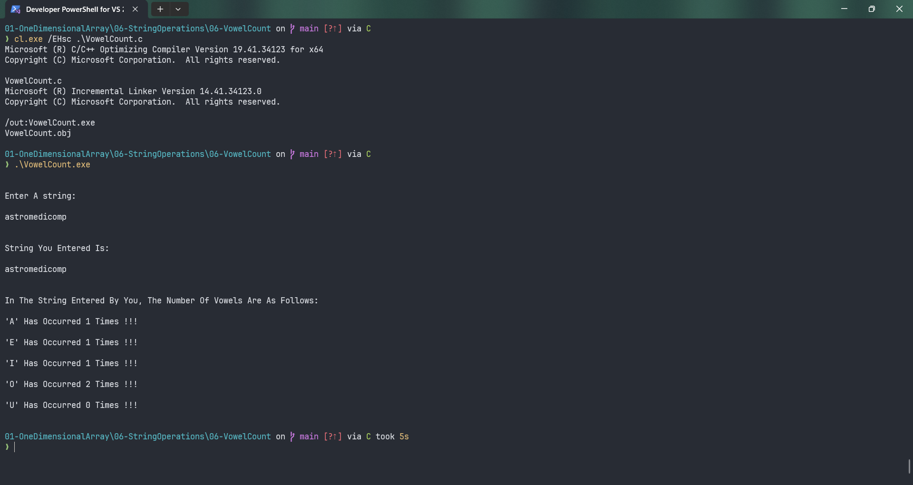

# VowelCount

Submitted by Yash Pravin Pawar (RTR2024-023)

## Output Screenshots


## Code
### [VowelCount.c](./01-Code/VowelCount.c)
```c
#include <stdio.h>

#define MAX_STRING_LENGTH 512

int main(void)
{
    int MyStrlen(char[]);

    char ypp_chArray[MAX_STRING_LENGTH];
    int ypp_iStringLength;
    int ypp_count_A = 0, ypp_count_E = 0, ypp_count_I = 0, ypp_count_O = 0, ypp_count_U = 0;

    int i;

    printf("\n\n");
    printf("Enter A string: \n\n");
    gets_s(ypp_chArray, MAX_STRING_LENGTH);

    printf("\n\n");
    printf("String You Entered Is: \n\n");
    printf("%s\n", ypp_chArray);

    ypp_iStringLength = MyStrlen(ypp_chArray);

    for (i = 0; i < ypp_iStringLength; i++)
    {
        switch (ypp_chArray[i])
        {
        case 'A':
        case 'a':
            ypp_count_A++;
            break;
        case 'E':
        case 'e':
            ypp_count_E++;
            break;
        case 'I':
        case 'i':
            ypp_count_I++;
            break;
        case 'O':
        case 'o':
            ypp_count_O++;
            break;
        case 'U':
        case 'u':
            ypp_count_U++;
            break;
        default:
            break;
        }
    }

    printf("\n\n");
    printf("In The String Entered By You, The Number Of Vowels Are As Follows: \n\n");
    printf("'A' Has Occurred %d Times !!!\n\n", ypp_count_A);
    printf("'E' Has Occurred %d Times !!!\n\n", ypp_count_E);
    printf("'I' Has Occurred %d Times !!!\n\n", ypp_count_I);
    printf("'O' Has Occurred %d Times !!!\n\n", ypp_count_O);
    printf("'U' Has Occurred %d Times !!!\n\n", ypp_count_U);

    return (0);
}

int MyStrlen(char str[])
{
    int j;
    int string_length = 0;

    for (j = 0; j < MAX_STRING_LENGTH; j++)
    {
        if (str[j] == '\0')
            break;
        else
            string_length++;
    }

    return (string_length);
}

```
