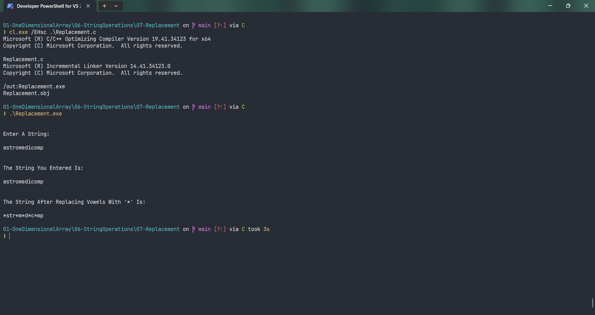

# Replacement

Submitted by Yash Pravin Pawar (RTR2024-023)

## Output Screenshots


## Code
### [Replacement.c](./01-Code/Replacement.c)
```c
#include <stdio.h>

#define MAX_STRING_LENGTH 512

int main(void)
{
    int MyStrlen(char[]);
    void MyStrcpy(char[], char[]);

    char ypp_chArray_Original[MAX_STRING_LENGTH];
    char ypp_chArray_VowelsReplaced[MAX_STRING_LENGTH];

    int ypp_iStringLength;
    int i;

    printf("\n\n");
    printf("Enter A String: \n\n");
    gets_s(ypp_chArray_Original, MAX_STRING_LENGTH);

    MyStrcpy(ypp_chArray_VowelsReplaced, ypp_chArray_Original);

    ypp_iStringLength = MyStrlen(ypp_chArray_VowelsReplaced);

    for (i = 0; i < ypp_iStringLength; i++)
    {
        switch (ypp_chArray_VowelsReplaced[i])
        {
        case 'A':
        case 'a':
        case 'E':
        case 'e':
        case 'I':
        case 'i':
        case 'O':
        case 'o':
        case 'U':
        case 'u':
            ypp_chArray_VowelsReplaced[i] = '*';
            break;
        default:
            break;
        }
    }

    printf("\n\n");
    printf("The String You Entered Is: \n\n");
    printf("%s\n", ypp_chArray_Original);

    printf("\n\n");
    printf("The String After Replacing Vowels With '*' Is: \n\n");
    printf("%s\n", ypp_chArray_VowelsReplaced);

    return (0);
}

int MyStrlen(char str[])
{
    int j;
    int string_length = 0;

    for (j = 0; j < MAX_STRING_LENGTH; j++)
    {
        if (str[j] == '\0')
            break;
        else
            string_length++;
    }

    return (string_length);
}

void MyStrcpy(char str_destination[], char str_source[])
{
    int MyStrlen(char[]);

    int iStringLength = 0;
    int j;

    iStringLength = MyStrlen(str_source);
    for (j = 0; j < iStringLength; j++)
        str_destination[j] = str_source[j];
    
    str_destination[j] = '\0';
}

```
