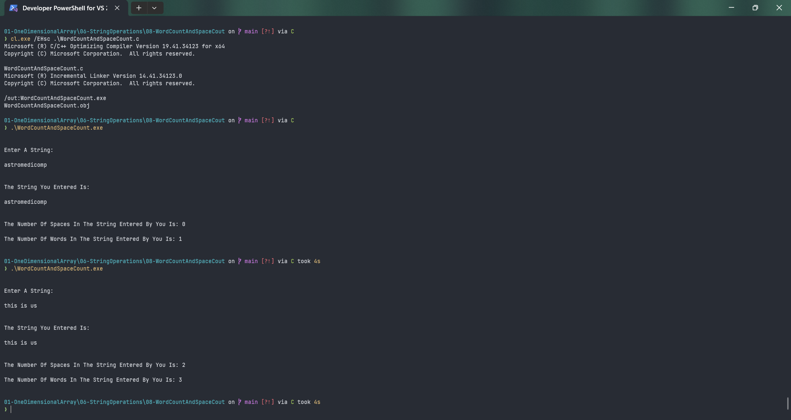

# WordCountAndSpaceCount

Submitted by Yash Pravin Pawar (RTR2024-023)

## Output Screenshots


## Code
### [WordCountAndSpaceCount.c](./01-Code/WordCountAndSpaceCount.c)
```c
#include <stdio.h>

#define MAX_STRING_LENGTH 512

int main(void)
{
    int MyStrlen(char[]);

    char ypp_chArray[MAX_STRING_LENGTH];
    int ypp_iStringLength;
    int i;
    int ypp_word_count = 0, ypp_space_count = 0;

    printf("\n\n");
    printf("Enter A String: \n\n");
    gets_s(ypp_chArray, MAX_STRING_LENGTH);

    ypp_iStringLength = MyStrlen(ypp_chArray);

    for (i = 0; i < ypp_iStringLength; i++)
    {
        switch (ypp_chArray[i])
        {
        case 32:
            ypp_space_count++;
            break;
        default:
            break;
        }
    }

    ypp_word_count = ypp_space_count + 1;

    printf("\n\n");
    printf("The String You Entered Is: \n\n");
    printf("%s\n", ypp_chArray);

    printf("\n\n");
    printf("The Number Of Spaces In The String Entered By You Is: %d\n\n", ypp_space_count);
    printf("The Number Of Words In The String Entered By You Is: %d\n\n", ypp_word_count);

    return (0);
}

int MyStrlen(char str[])
{
    int j;
    int string_length = 0;

    for (j = 0; j < MAX_STRING_LENGTH; j++)
    {
        if (str[j] == '\0')
            break;
        else
            string_length++;
    }

    return (string_length);
}

```
