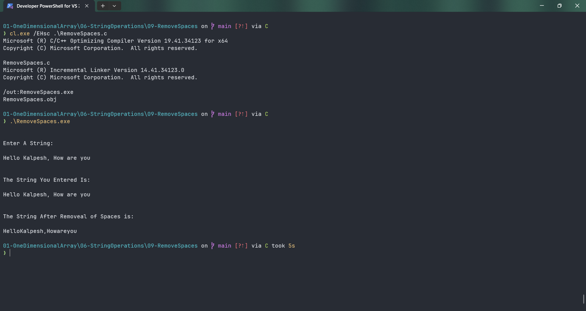

# RemoveSpaces

Submitted by Yash Pravin Pawar (RTR2024-023)

## Output Screenshots


## Code
### [RemoveSpaces.c](./01-Code/RemoveSpaces.c)
```c
#include <stdio.h>

#define MAX_STRING_LENGTH 512

int main(void)
{
    int MyStrlen(char[]);

    char ypp_chArray[MAX_STRING_LENGTH];
    char ypp_chArray_SpacesRemoved[MAX_STRING_LENGTH];

    int ypp_iStringLength;
    int i, j;

    printf("\n\n");
    printf("Enter A String: \n\n");
    gets_s(ypp_chArray, MAX_STRING_LENGTH);

    ypp_iStringLength = MyStrlen(ypp_chArray);
    
    j = 0;
    for (i = 0; i < ypp_iStringLength; i++)
    {
        if (ypp_chArray[i] == ' ')
            continue;
        else
        {
            ypp_chArray_SpacesRemoved[j] = ypp_chArray[i];
            j++;
        }
    }

    ypp_chArray_SpacesRemoved[j] = '\0';

    printf("\n\n");
    printf("The String You Entered Is: \n\n");
    printf("%s\n", ypp_chArray);

    printf("\n\n");
    printf("The String After Removeal of Spaces is: \n\n");
    printf("%s\n", ypp_chArray_SpacesRemoved);

    return (0);
}

int MyStrlen(char str[])
{
    int j;
    int string_length = 0;

    for (j = 0; j < MAX_STRING_LENGTH; j++)
    {
        if (str[j] == '\0')
            break;
        else
            string_length++;
    }

    return (string_length);
}

```
