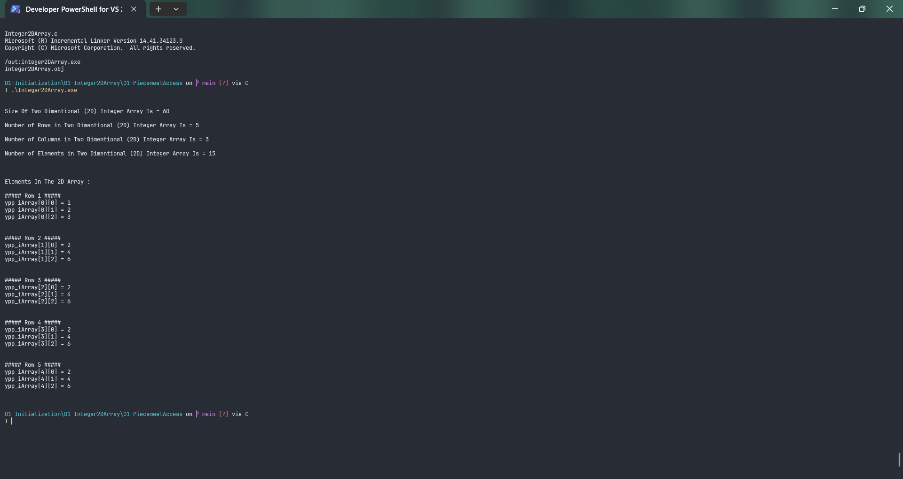

# Integer2DArray

Submitted by Yash Pravin Pawar (RTR2024-023)

## Output Screenshots


## Code
### [Integer2DArray.c](./01-Code/Integer2DArray.c)
```c
#include <stdio.h>

int main(void)
{
    int ypp_iArray[5][3] = {
        { 1, 2, 3 },
        { 2, 4, 6 },
        { 3, 6, 9 },
        { 4, 8, 12 },
        { 5, 10, 15 },
    }; // inline initialization

    int ypp_int_size;
    int ypp_iArray_size;
    int ypp_iArray_num_elements, ypp_iArray_num_rows, ypp_iArray_num_columns;

    printf("\n\n");

    ypp_int_size = sizeof(int);

    ypp_iArray_size = sizeof(ypp_iArray);
    printf("Size Of Two Dimentional (2D) Integer Array Is = %d\n\n", ypp_iArray_size);

    ypp_iArray_num_rows = ypp_iArray_size / sizeof(ypp_iArray[0]);
    printf("Number of Rows in Two Dimentional (2D) Integer Array Is = %d\n\n", ypp_iArray_num_rows);

    ypp_iArray_num_columns = sizeof(ypp_iArray[0]) / ypp_int_size;
    printf("Number of Columns in Two Dimentional (2D) Integer Array Is = %d\n\n", ypp_iArray_num_columns);

    ypp_iArray_num_elements = ypp_iArray_num_rows * ypp_iArray_num_columns;
    printf("Number of Elements in Two Dimentional (2D) Integer Array Is = %d\n\n", ypp_iArray_num_elements);

    printf("\n\n");
    printf("Elements In The 2D Array : \n\n");

    printf("##### Row 1 #####\n");
    printf("ypp_iArray[0][0] = %d\n", ypp_iArray[0][0]);
    printf("ypp_iArray[0][1] = %d\n", ypp_iArray[0][1]);
    printf("ypp_iArray[0][2] = %d\n", ypp_iArray[0][2]);
    printf("\n\n");

    printf("##### Row 2 #####\n");
    printf("ypp_iArray[1][0] = %d\n", ypp_iArray[1][0]);
    printf("ypp_iArray[1][1] = %d\n", ypp_iArray[1][1]);
    printf("ypp_iArray[1][2] = %d\n", ypp_iArray[1][2]);
    printf("\n\n");

    printf("##### Row 3 #####\n");
    printf("ypp_iArray[2][0] = %d\n", ypp_iArray[1][0]);
    printf("ypp_iArray[2][1] = %d\n", ypp_iArray[1][1]);
    printf("ypp_iArray[2][2] = %d\n", ypp_iArray[1][2]);
    printf("\n\n");
    
    printf("##### Row 4 #####\n");
    printf("ypp_iArray[3][0] = %d\n", ypp_iArray[1][0]);
    printf("ypp_iArray[3][1] = %d\n", ypp_iArray[1][1]);
    printf("ypp_iArray[3][2] = %d\n", ypp_iArray[1][2]);
    printf("\n\n");
    
    printf("##### Row 5 #####\n");
    printf("ypp_iArray[4][0] = %d\n", ypp_iArray[1][0]);
    printf("ypp_iArray[4][1] = %d\n", ypp_iArray[1][1]);
    printf("ypp_iArray[4][2] = %d\n", ypp_iArray[1][2]);
    printf("\n\n");

    return (0);
}

```
