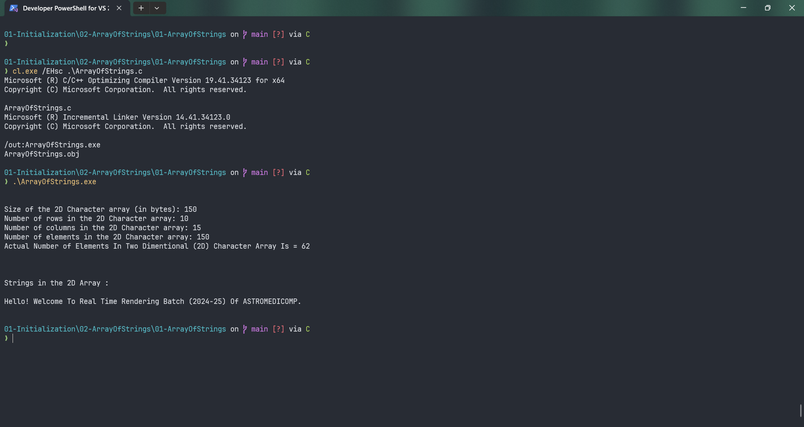

# ArrayOfStrings

Submitted by Yash Pravin Pawar (RTR2024-023)

## Output Screenshots


## Code
### [ArrayOfStrings.c](./01-Code/ArrayOfStrings.c)
```c
#include <stdio.h>

#define MAX_STRING_LENGTH 512

int main(void)
{
    int MyStrlen(char[]);

    char ypp_strArray[10][15] = {
        "Hello!",
        "Welcome",
        "To",
        "Real",
        "Time",
        "Rendering",
        "Batch",
        "(2024-25)",
        "Of",
        "ASTROMEDICOMP.",
    };

    int ypp_char_size;
    int ypp_strArray_size;
    int ypp_strArray_num_elements, ypp_strArray_num_rows, ypp_strArray_num_columns;
    int ypp_strActual_num_chars = 0;

    int i;

    printf("\n\n");

    ypp_char_size = sizeof(char);

    ypp_strArray_size = sizeof(ypp_strArray);
    printf("Size of the 2D Character array (in bytes): %d\n", ypp_strArray_size);

    ypp_strArray_num_rows = ypp_strArray_size / sizeof(ypp_strArray[0]);
    printf("Number of rows in the 2D Character array: %d\n", ypp_strArray_num_rows);

    ypp_strArray_num_columns = sizeof(ypp_strArray[0]) / ypp_char_size;
    printf("Number of columns in the 2D Character array: %d\n", ypp_strArray_num_columns);

    ypp_strArray_num_elements = ypp_strArray_num_rows * ypp_strArray_num_columns;
    printf("Number of elements in the 2D Character array: %d\n", ypp_strArray_num_elements);

    for (i = 0; i < ypp_strArray_num_rows; i++)
    {
        ypp_strActual_num_chars += MyStrlen(ypp_strArray[i]);
    }

    printf("Actual Number of Elements In Two Dimentional (2D) Character Array Is = %d\n\n", ypp_strActual_num_chars);

    printf("\n\n");

    printf("Strings in the 2D Array : \n\n");

    printf("%s ", ypp_strArray[0]);
    printf("%s ", ypp_strArray[1]);
    printf("%s ", ypp_strArray[2]);
    printf("%s ", ypp_strArray[3]);
    printf("%s ", ypp_strArray[4]);
    printf("%s ", ypp_strArray[5]);
    printf("%s ", ypp_strArray[6]);
    printf("%s ", ypp_strArray[7]);
    printf("%s ", ypp_strArray[8]);
    printf("%s \n\n", ypp_strArray[9]);

    return (0);
}

int MyStrlen(char str[])
{
    int string_length = 0;
    int j;

    for (j = 0; j < MAX_STRING_LENGTH; j++)
    {
        if (str[j] == '\0')
            break;
        else
            string_length++;
    }

    return (string_length);
}

```
