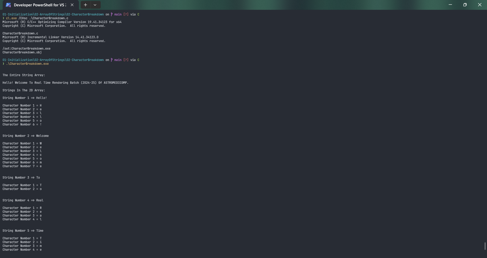
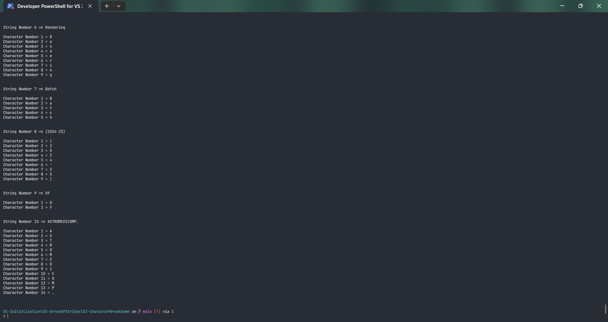

# CharacterBreakdown

Submitted by Yash Pravin Pawar (RTR2024-023)

## Output Screenshots



## Code
### [CharacterBreakdown.c](./01-Code/CharacterBreakdown.c)
```c
#include <stdio.h>

#define MAX_STRING_LENGTH 512

int main(void)
{
    int MyStrlen(char[]);

    char ypp_strArray[10][15] = {
        "Hello!",
        "Welcome",
        "To",
        "Real",
        "Time",
        "Rendering",
        "Batch",
        "(2024-25)",
        "Of",
        "ASTROMEDICOMP.",
    };

    int ypp_iStrLengths[10];
    int ypp_strArray_size;
    int ypp_strArray_num_rows;
    int i, j;

    ypp_strArray_size = sizeof(ypp_strArray);
    ypp_strArray_num_rows = ypp_strArray_size / sizeof(ypp_strArray[0]);

    for (i = 0; i < ypp_strArray_num_rows; i++)
        ypp_iStrLengths[i] = MyStrlen(ypp_strArray[i]);
    
    printf("\n\n");
    printf("The Entire String Array: \n\n");
    
    for (i = 0; i < ypp_strArray_num_rows; i++)
        printf("%s ", ypp_strArray[i]);

    printf("\n\n");
    printf("Strings In The 2D Array: \n\n");
    for (i = 0; i < ypp_strArray_num_rows; i++)
    {
        printf("String Number %d => %s\n\n", (i + 1), ypp_strArray[i]);

        for (j = 0; j < ypp_iStrLengths[i]; j++)
            printf("Character Number %d = %c\n", (j + 1), ypp_strArray[i][j]);

        printf("\n\n");
    }

    return (0);
}

int MyStrlen(char str[])
{
    int string_length = 0;
    int j;

    for (j = 0; j < MAX_STRING_LENGTH; j++)
    {
        if (str[j] == '\0')
            break;
        else
            string_length++;
    }

    return (string_length);
}

```
