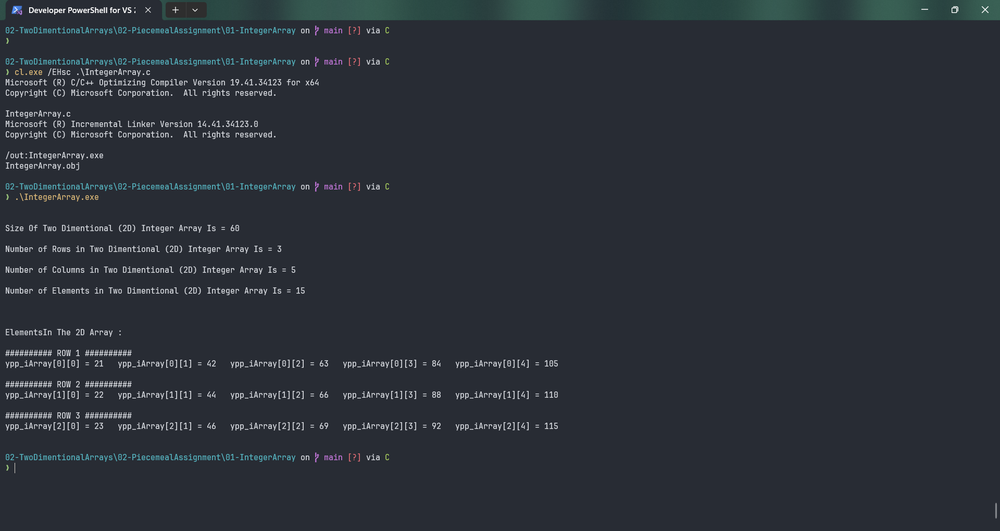

# IntegerArray

Submitted by Yash Pravin Pawar (RTR2024-023)

## Output Screenshots


## Code
### [IntegerArray.c](./01-Code/IntegerArray.c)
```c
#include <stdio.h>

int main(void)
{
    int ypp_iArray[3][5];
    int ypp_int_size;
    int ypp_iArray_size;
    int ypp_iArray_num_elements, ypp_iArray_num_rows, ypp_iArray_num_columns;
    int i, j;

    printf("\n\n");
    
    ypp_int_size = sizeof(int);

    ypp_iArray_size = sizeof(ypp_iArray);
    printf("Size Of Two Dimentional (2D) Integer Array Is = %d\n\n", ypp_iArray_size);

    ypp_iArray_num_rows = ypp_iArray_size / sizeof(ypp_iArray[0]);
    printf("Number of Rows in Two Dimentional (2D) Integer Array Is = %d\n\n", ypp_iArray_num_rows);

    ypp_iArray_num_columns = sizeof(ypp_iArray[0]) / ypp_int_size;
    printf("Number of Columns in Two Dimentional (2D) Integer Array Is = %d\n\n", ypp_iArray_num_columns);

    ypp_iArray_num_elements = ypp_iArray_num_rows * ypp_iArray_num_columns;
    printf("Number of Elements in Two Dimentional (2D) Integer Array Is = %d\n\n", ypp_iArray_num_elements);

    printf("\n\n");
    printf("ElementsIn The 2D Array : \n\n");

    ypp_iArray[0][0] = 21;
    ypp_iArray[0][1] = 42;
    ypp_iArray[0][2] = 63;
    ypp_iArray[0][3] = 84;
    ypp_iArray[0][4] = 105;

    ypp_iArray[1][0] = 22;
    ypp_iArray[1][1] = 44;
    ypp_iArray[1][2] = 66;
    ypp_iArray[1][3] = 88;
    ypp_iArray[1][4] = 110;

    ypp_iArray[2][0] = 23;
    ypp_iArray[2][1] = 46;
    ypp_iArray[2][2] = 69;
    ypp_iArray[2][3] = 92;
    ypp_iArray[2][4] = 115;

    for (i = 0; i < ypp_iArray_num_rows; i++)
    {
        printf("########## ROW %d ##########\n", i + 1);
        for (j = 0; j < ypp_iArray_num_columns; j++)
        {
            printf("ypp_iArray[%d][%d] = %d\t", i, j, ypp_iArray[i][j]);
        }

        printf("\n\n");
    }

    return (0);
}

```
