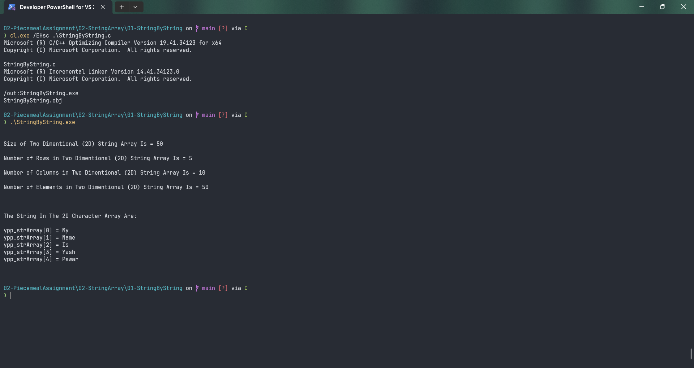

# StringByString

Submitted by Yash Pravin Pawar (RTR2024-023)

## Output Screenshots


## Code
### [StringByString.c](./01-Code/StringByString.c)
```c
#include <stdio.h>

#define MAX_STRING_LENGTH 512

int main(void)
{
    void MyStrCpy(char[], char[]);

    char ypp_strArray[5][10];
    int ypp_char_size;
    int ypp_strArray_size;
    int ypp_strArray_num_elements, ypp_strArray_num_rows, ypp_strArray_num_columns;
    int i;

    printf("\n\n");

    ypp_char_size = sizeof(char);

    ypp_strArray_size = sizeof(ypp_strArray);
    printf("Size of Two Dimentional (2D) String Array Is = %d\n\n", ypp_strArray_size);

    ypp_strArray_num_rows = ypp_strArray_size / sizeof(ypp_strArray[0]);
    printf("Number of Rows in Two Dimentional (2D) String Array Is = %d\n\n", ypp_strArray_num_rows);

    ypp_strArray_num_columns = sizeof(ypp_strArray[0]) / ypp_char_size;
    printf("Number of Columns in Two Dimentional (2D) String Array Is = %d\n\n", ypp_strArray_num_columns);

    ypp_strArray_num_elements = ypp_strArray_num_rows * ypp_strArray_num_columns;
    printf("Number of Elements in Two Dimentional (2D) String Array Is = %d\n\n", ypp_strArray_num_elements);

    MyStrCpy(ypp_strArray[0], "My");
    MyStrCpy(ypp_strArray[1], "Name");
    MyStrCpy(ypp_strArray[2], "Is");
    MyStrCpy(ypp_strArray[3], "Yash");
    MyStrCpy(ypp_strArray[4], "Pawar");

    printf("\n\n");
    printf("The String In The 2D Character Array Are: \n\n");

    for (i = 0; i < ypp_strArray_num_rows; i++)
        printf("ypp_strArray[%d] = %s\n", i, ypp_strArray[i]);
    
    printf("\n\n");

    return (0);
}

void MyStrCpy(char str_destination[], char str_source[])
{
    int MyStrlen(char[]);

    int iStringLength = 0;
    int j;

    iStringLength = MyStrlen(str_source);
    for (j = 0; j < iStringLength; j++)
        str_destination[j] = str_source[j];

    str_destination[j] = '\0';
}

int MyStrlen(char str[])
{
    int string_length = 0;
    int j;

    for (j = 0; j < MAX_STRING_LENGTH; j++)
    {
        if (str[j] == '\0')
            break;
        else
            string_length++;
    }

    return (string_length);
}

```
