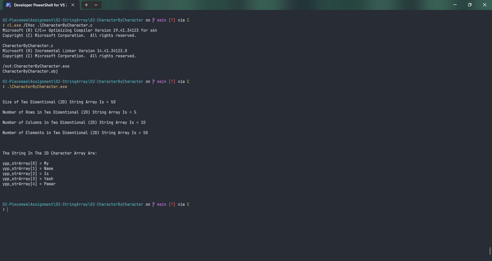

# CharacterByCharacter

Submitted by Yash Pravin Pawar (RTR2024-023)

## Output Screenshots


## Code
### [CharacterByCharacter.c](./01-Code/CharacterByCharacter.c)
```c
#include <stdio.h>

#define MAX_STRING_LENGTH 512

int main(void)
{
    char ypp_strArray[5][10];
    int ypp_char_size;
    int ypp_strArray_size;
    int ypp_strArray_num_elements, ypp_strArray_num_rows, ypp_strArray_num_columns;
    int i;

    printf("\n\n");

    ypp_char_size = sizeof(char);
    ypp_strArray_size = sizeof(ypp_strArray);

    printf("Size of Two Dimentional (2D) String Array Is = %d\n\n", ypp_strArray_size);

    ypp_strArray_num_rows = ypp_strArray_size / sizeof(ypp_strArray[0]);
    printf("Number of Rows in Two Dimentional (2D) String Array Is = %d\n\n", ypp_strArray_num_rows);

    ypp_strArray_num_columns = sizeof(ypp_strArray[0]) / ypp_char_size;
    printf("Number of Columns in Two Dimentional (2D) String Array Is = %d\n\n", ypp_strArray_num_columns);

    ypp_strArray_num_elements = ypp_strArray_num_rows * ypp_strArray_num_columns;
    printf("Number of Elements in Two Dimentional (2D) String Array Is = %d\n\n", ypp_strArray_num_elements);

    ypp_strArray[0][0] = 'M';
    ypp_strArray[0][1] = 'y';
    ypp_strArray[0][2] = '\0';

    ypp_strArray[1][0] = 'N';
    ypp_strArray[1][1] = 'a';
    ypp_strArray[1][2] = 'm';
    ypp_strArray[1][3] = 'e';
    ypp_strArray[1][4] = '\0';

    ypp_strArray[2][0] = 'I';
    ypp_strArray[2][1] = 's';
    ypp_strArray[2][2] = '\0';

    ypp_strArray[3][0] = 'Y';
    ypp_strArray[3][1] = 'a';
    ypp_strArray[3][2] = 's';
    ypp_strArray[3][3] = 'h';
    ypp_strArray[3][4] = '\0';

    ypp_strArray[4][0] = 'P';
    ypp_strArray[4][1] = 'a';
    ypp_strArray[4][2] = 'w';
    ypp_strArray[4][3] = 'a';
    ypp_strArray[4][4] = 'r';
    ypp_strArray[4][5] = '\0';

    printf("\n\n");
    printf("The String In The 2D Character Array Are: \n\n");
    for (i = 0; i < ypp_strArray_num_rows; i++)
        printf("ypp_strArray[%d] = %s\n", i, ypp_strArray[i]);

    printf("\n\n");

    return (0);
}

```
