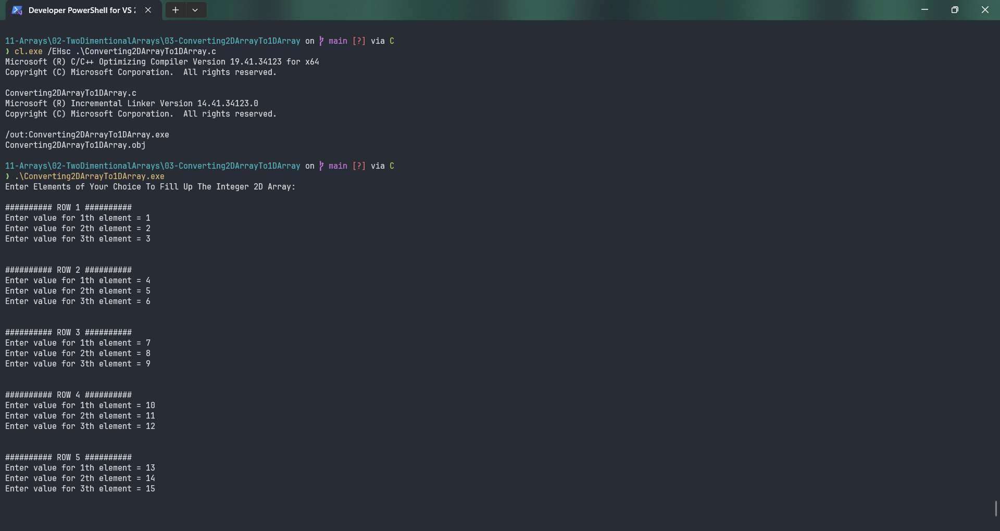

# Converting2DArrayTo1DArray

Submitted by Yash Pravin Pawar (RTR2024-023)

## Output Screenshots



## Code
### [Converting2DArrayTo1DArray.c](./01-Code/Converting2DArrayTo1DArray.c)
```c
#include <stdio.h>

#define NUM_ROWS 5
#define NUM_COLUMNS 3

int main(void)
{
    int ypp_iArray_2D[NUM_ROWS][NUM_COLUMNS];
    int ypp_iArray_1D[NUM_ROWS * NUM_COLUMNS];

    int i, j;
    int num;

    printf("Enter Elements of Your Choice To Fill Up The Integer 2D Array: \n\n");
    for (i = 0; i < NUM_ROWS; i++)
    {
        printf("########## ROW %d ##########\n", (i + 1));
        for (j = 0; j < NUM_COLUMNS; j++)
        {
            printf("Enter value for %dth element = ", (j + 1));
            scanf("%d", &num);
            ypp_iArray_2D[i][j] = num;
        }
        printf("\n\n");
    }

    printf("\n\n");
    printf("Two-Dimensional ( 2D ) Array Of Integers : \n\n");
    for (i = 0; i < NUM_ROWS; i++)
    {
        printf("########## ROW %d ##########\n", (i + 1));
        for (j = 0; j < NUM_COLUMNS; j++)
        {
            printf("ypp_iArray_2D[%d][%d] = %d\t", i, j, ypp_iArray_2D[i][j]);
        }

        printf("\n\n");
    }

    // converting from 2D to 1D
    for (i = 0; i < NUM_ROWS; i++)
    {
        for (j = 0; j < NUM_COLUMNS; j++)
        {
            ypp_iArray_1D[(i * NUM_COLUMNS) + j] = ypp_iArray_2D[i][j];
        }
    }

    printf("\n\n");
    printf("One-Dimensional ( 1D ) Array Of Integers : \n\n");
    for (i = 0; i < (NUM_ROWS * NUM_COLUMNS); i++)
    {
        printf("ypp_iArray_1D[%d] = %d\n", i, ypp_iArray_1D[i]);
    }

    printf("\n\n");

    return (0);
}

```
