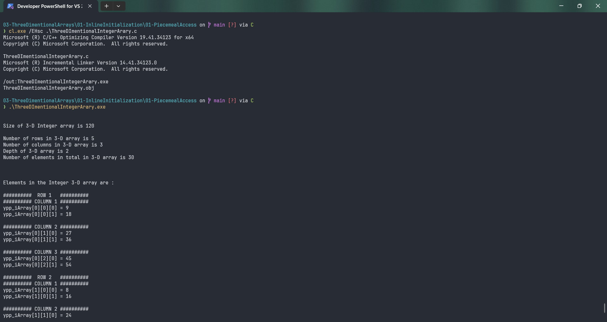
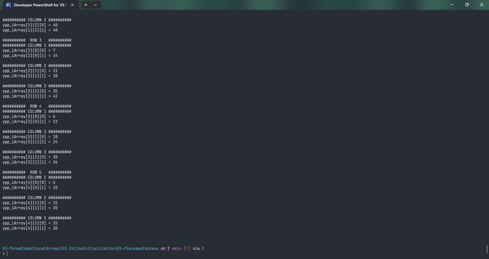

# ThreeDImentionalIntegerArary

Submitted by Yash Pravin Pawar (RTR2024-023)

## Output Screenshots



## Code
### [ThreeDImentionalIntegerArary.c](./01-Code/ThreeDImentionalIntegerArary.c)
```c
#include <stdio.h>

int main(void)
{
    int ypp_iArray[5][3][2] = {
        { { 9, 18 }, { 27, 36 }, { 45, 54 } },
        { { 8, 16 }, { 24, 32 }, { 40, 48 } },
        { { 7, 14 }, { 21, 28 }, { 35, 42 } },
        { { 6, 12 }, { 18, 24 }, { 30, 36 } },
        { { 5, 10 }, { 15, 20 }, { 25, 30 } },
    };

    int int_size;
    int iArray_size;
    int iArray_num_elements, iArray_width, iArray_height, iArray_depth;

    printf("\n\n");

    int_size = sizeof(int);
    iArray_size = sizeof(ypp_iArray);
    printf("Size of 3-D Integer array is %lu\n\n", iArray_size);

    iArray_width = sizeof(ypp_iArray) / sizeof(ypp_iArray[0]);
    printf("Number of rows in 3-D array is %d\n", iArray_width);

    iArray_height = sizeof(ypp_iArray[0]) / sizeof(ypp_iArray[0][0]);
    printf("Number of columns in 3-D array is %d\n", iArray_height);

    iArray_depth = sizeof(ypp_iArray[0][0]) / sizeof(ypp_iArray[0][0][0]);
    printf("Depth of 3-D array is %d\n", iArray_depth);

    iArray_num_elements = iArray_width * iArray_height * iArray_depth;
    printf("Number of elements in total in 3-D array is %d\n\n", iArray_num_elements);

    printf("\n\n");
    printf("Elements in the Integer 3-D array are : \n\n");

    printf("##########  ROW 1   ##########\n");
    printf("########## COLUMN 1 ##########\n");
    printf("ypp_iArray[0][0][0] = %d\n", ypp_iArray[0][0][0]);
    printf("ypp_iArray[0][0][1] = %d\n", ypp_iArray[0][0][1]);
    printf("\n");

    printf("########## COLUMN 2 ##########\n");
    printf("ypp_iArray[0][1][0] = %d\n", ypp_iArray[0][1][0]);
    printf("ypp_iArray[0][1][1] = %d\n", ypp_iArray[0][1][1]);
    printf("\n");

    printf("########## COLUMN 3 ##########\n");
    printf("ypp_iArray[0][2][0] = %d\n", ypp_iArray[0][2][0]);
    printf("ypp_iArray[0][2][1] = %d\n", ypp_iArray[0][2][1]);
    printf("\n");

    printf("##########  ROW 2   ##########\n");
    printf("########## COLUMN 1 ##########\n");
    printf("ypp_iArray[1][0][0] = %d\n", ypp_iArray[1][0][0]);
    printf("ypp_iArray[1][0][1] = %d\n", ypp_iArray[1][0][1]);
    printf("\n");

    printf("########## COLUMN 2 ##########\n");
    printf("ypp_iArray[1][1][0] = %d\n", ypp_iArray[1][1][0]);
    printf("ypp_iArray[1][1][1] = %d\n", ypp_iArray[1][1][1]);
    printf("\n");

    printf("########## COLUMN 3 ##########\n");
    printf("ypp_iArray[1][2][0] = %d\n", ypp_iArray[1][2][0]);
    printf("ypp_iArray[1][2][1] = %d\n", ypp_iArray[1][2][1]);
    printf("\n");

    printf("##########  ROW 3   ##########\n");
    printf("########## COLUMN 1 ##########\n");
    printf("ypp_iArray[2][0][0] = %d\n", ypp_iArray[2][0][0]);
    printf("ypp_iArray[2][0][1] = %d\n", ypp_iArray[2][0][1]);
    printf("\n");

    printf("########## COLUMN 2 ##########\n");
    printf("ypp_iArray[2][1][0] = %d\n", ypp_iArray[2][1][0]);
    printf("ypp_iArray[2][1][1] = %d\n", ypp_iArray[2][1][1]);
    printf("\n");

    printf("########## COLUMN 3 ##########\n");
    printf("ypp_iArray[2][2][0] = %d\n", ypp_iArray[2][2][0]);
    printf("ypp_iArray[2][2][1] = %d\n", ypp_iArray[2][2][1]);
    printf("\n");

    printf("##########  ROW 4   ##########\n");
    printf("########## COLUMN 1 ##########\n");
    printf("ypp_iArray[3][0][0] = %d\n", ypp_iArray[3][0][0]);
    printf("ypp_iArray[3][0][1] = %d\n", ypp_iArray[3][0][1]);
    printf("\n");

    printf("########## COLUMN 2 ##########\n");
    printf("ypp_iArray[3][1][0] = %d\n", ypp_iArray[3][1][0]);
    printf("ypp_iArray[3][1][1] = %d\n", ypp_iArray[3][1][1]);
    printf("\n");

    printf("########## COLUMN 3 ##########\n");
    printf("ypp_iArray[3][2][0] = %d\n", ypp_iArray[3][2][0]);
    printf("ypp_iArray[3][2][1] = %d\n", ypp_iArray[3][2][1]);
    printf("\n");

    printf("##########  ROW 5   ##########\n");
    printf("########## COLUMN 1 ##########\n");
    printf("ypp_iArray[4][0][0] = %d\n", ypp_iArray[4][0][0]);
    printf("ypp_iArray[4][0][1] = %d\n", ypp_iArray[4][0][1]);
    printf("\n");

    printf("########## COLUMN 2 ##########\n");
    printf("ypp_iArray[4][1][0] = %d\n", ypp_iArray[4][1][0]);
    printf("ypp_iArray[4][1][1] = %d\n", ypp_iArray[4][1][1]);
    printf("\n");

    printf("########## COLUMN 3 ##########\n");
    printf("ypp_iArray[4][2][0] = %d\n", ypp_iArray[4][2][0]);
    printf("ypp_iArray[4][2][1] = %d\n", ypp_iArray[4][2][1]);
    printf("\n\n");

    return (0);
}

```
