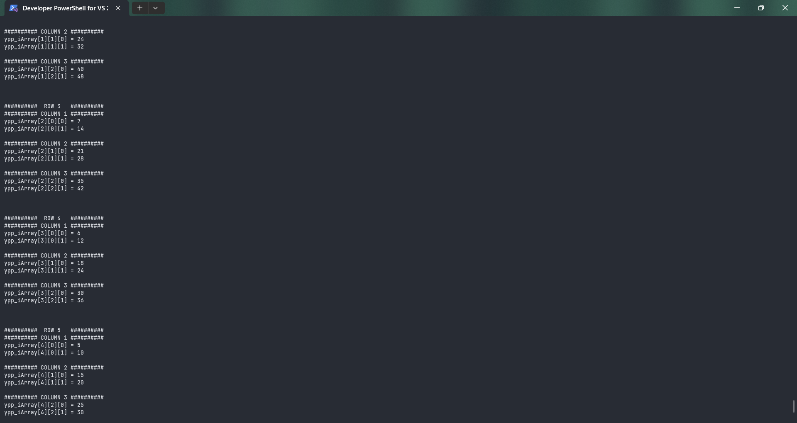
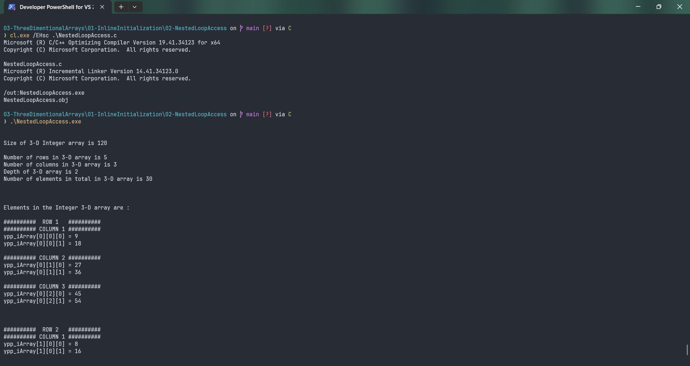

# NestedLoopAccess

Submitted by Yash Pravin Pawar (RTR2024-023)

## Output Screenshots



## Code
### [NestedLoopAccess.c](./01-Code/NestedLoopAccess.c)
```c
#include <stdio.h>

int main(void)
{
    int ypp_iArray[5][3][2] = {
        { { 9, 18 }, { 27, 36 }, { 45, 54 } },
        { { 8, 16 }, { 24, 32 }, { 40, 48 } },
        { { 7, 14 }, { 21, 28 }, { 35, 42 } },
        { { 6, 12 }, { 18, 24 }, { 30, 36 } },
        { { 5, 10 }, { 15, 20 }, { 25, 30 } },
    };

    int int_size;
    int iArray_size;
    int iArray_num_elements, iArray_width, iArray_height, iArray_depth;
    int i, j, k;

    printf("\n\n");

    int_size = sizeof(int);
    iArray_size = sizeof(ypp_iArray);
    printf("Size of 3-D Integer array is %lu\n\n", iArray_size);

    iArray_width = sizeof(ypp_iArray) / sizeof(ypp_iArray[0]);
    printf("Number of rows in 3-D array is %d\n", iArray_width);

    iArray_height = sizeof(ypp_iArray[0]) / sizeof(ypp_iArray[0][0]);
    printf("Number of columns in 3-D array is %d\n", iArray_height);

    iArray_depth = sizeof(ypp_iArray[0][0]) / sizeof(ypp_iArray[0][0][0]);
    printf("Depth of 3-D array is %d\n", iArray_depth);

    iArray_num_elements = iArray_width * iArray_height * iArray_depth;
    printf("Number of elements in total in 3-D array is %d\n\n", iArray_num_elements);

    printf("\n\n");
    printf("Elements in the Integer 3-D array are : \n\n");

    for (i = 0; i < iArray_width; i++)
    {
        printf("##########  ROW %d   ##########\n", i + 1);
        for (j = 0; j < iArray_height; j++)
        {
            printf("########## COLUMN %d ##########\n", j + 1);
            for (k = 0; k < iArray_depth; k++)
            {
                printf("ypp_iArray[%d][%d][%d] = %d\n", i, j, k, ypp_iArray[i][j][k]);
            }
            printf("\n");
        }
        printf("\n\n");
    }

    return (0);
}

```
