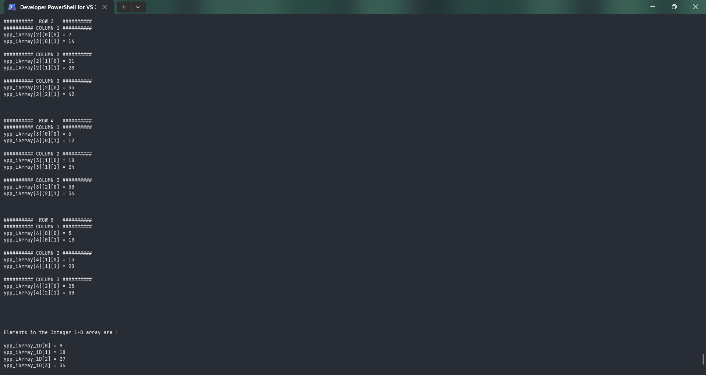

# Converting3DArrayTo1DArray

Submitted by Yash Pravin Pawar (RTR2024-023)

## Output Screenshots




## Code
### [Converting3DArrayTo1DArray.c](./01-Code/Converting3DArrayTo1DArray.c)
```c
#include <stdio.h>

#define NUM_ROWS 5
#define NUM_COLUMNS 3
#define NUM_DEPTH 2

int main(void)
{
    int ypp_iArray[NUM_ROWS][NUM_COLUMNS][NUM_DEPTH] = {
        { { 9, 18 }, { 27, 36 }, { 45, 54 } },
        { { 8, 16 }, { 24, 32 }, { 40, 48 } },
        { { 7, 14 }, { 21, 28 }, { 35, 42 } },
        { { 6, 12 }, { 18, 24 }, { 30, 36 } },
        { { 5, 10 }, { 15, 20 }, { 25, 30 } },
    };

    int i, j, k;
    int ypp_iArray_1D[NUM_ROWS * NUM_COLUMNS * NUM_DEPTH];

    // displaying 3d array
    printf("\n\n");
    printf("Elements in the Integer 3-D array are : \n\n");
    for (i = 0; i < NUM_ROWS; i++)
    {
        printf("##########  ROW %d   ##########\n", i + 1);
        for (j = 0; j < NUM_COLUMNS; j++)
        {
            printf("########## COLUMN %d ##########\n", j + 1);
            for (k = 0; k < NUM_DEPTH; k++)
            {
                printf("ypp_iArray[%d][%d][%d] = %d\n", i, j, k, ypp_iArray[i][j][k]);
            }
            printf("\n");
        }
        printf("\n\n");
    }

    // converting rom 3d to 1d
    for (i = 0; i < NUM_ROWS; i++)
    {
        for (j = 0; j < NUM_COLUMNS; j++)
        {
            for (k = 0; k < NUM_DEPTH; k++)
            {
                ypp_iArray_1D[(i * NUM_COLUMNS * NUM_DEPTH) + (j * NUM_DEPTH) + k] = ypp_iArray[i][j][k];
            }
        }
    }

    // displaying 1d array
    printf("\n\n");
    printf("Elements in the Integer 1-D array are : \n\n");
    for (i = 0; i < (NUM_ROWS * NUM_COLUMNS * NUM_DEPTH); i++)
    {
        printf("ypp_iArray_1D[%d] = %d\n", i, ypp_iArray_1D[i]);
    }

    return (0);
}

```
