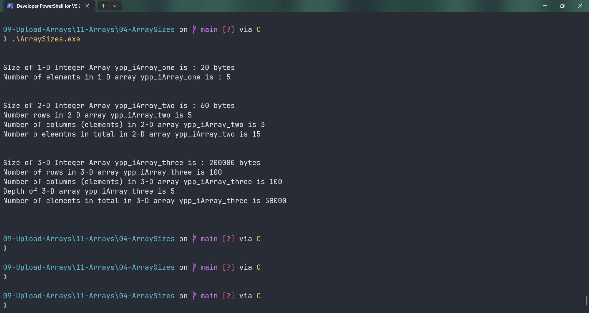

# ArraySizes

Submitted by Yash Pravin Pawar (RTR2024-023)

## Output Screenshots


## Code
### [ArraySizes.c](./01-Code/ArraySizes.c)
```c
#include <stdio.h>

int main(void)
{
    // variable declarations
    int ypp_iArray_one[5];
    int ypp_iArray_two[5][3];
    int ypp_iArray_three[100][100][5];

    int num_rows_2D;
    int num_columns_2D;

    int num_rows_3D;
    int num_columns_3D;
    int depth_3D;

    // code
    printf("\n\n"); 
    printf("SIze of 1-D Integer Array ypp_iArray_one is : %lu bytes\n", sizeof(ypp_iArray_one));
    printf("Number of elements in 1-D array ypp_iArray_one is : %lu\n", sizeof(ypp_iArray_one) / sizeof(int));

    printf("\n\n");
    printf("Size of 2-D Integer Array ypp_iArray_two is : %lu bytes\n", sizeof(ypp_iArray_two));

    printf("Number rows in 2-D array ypp_iArray_two is %lu\n", sizeof(ypp_iArray_two) / sizeof(ypp_iArray_two[0]));
    num_rows_2D = sizeof(ypp_iArray_two) / sizeof(ypp_iArray_two[0]);

    printf("Number of columns (elements) in 2-D array ypp_iArray_two is %lu\n", sizeof(ypp_iArray_two[0]) / sizeof(ypp_iArray_two[0][0]));
    num_columns_2D = sizeof(ypp_iArray_two[0]) / sizeof(ypp_iArray_two[0][0]);

    printf("Number o eleemtns in total in 2-D array ypp_iArray_two is %d\n", num_rows_2D * num_columns_2D);

    printf("\n\n");
    printf("Size of 3-D Integer Array ypp_iArray_three is : %lu bytes\n", sizeof(ypp_iArray_three));

    printf("Number of rows in 3-D array ypp_iArray_three is %lu\n", sizeof(ypp_iArray_three) / sizeof(ypp_iArray_three[0]));
    num_rows_3D = sizeof(ypp_iArray_three) / sizeof(ypp_iArray_three[0]);

    printf("Number of columns (elements) in 3-D array ypp_iArray_three is %lu\n", sizeof(ypp_iArray_three[0]) / sizeof(ypp_iArray_three[0][0]));
    num_columns_3D = sizeof(ypp_iArray_three[0]) / sizeof(ypp_iArray_three[0][0]);

    printf("Depth of 3-D array ypp_iArray_three is %lu\n", sizeof(ypp_iArray_three[0][0]) / sizeof(ypp_iArray_three[0][0][0]));
    depth_3D = sizeof(ypp_iArray_three[0][0]) / sizeof(ypp_iArray_three[0][0][0]);

    printf("Number of elements in total in 3-D array ypp_iArray_three is %d\n", num_rows_3D * num_columns_3D * depth_3D);

    printf("\n\n");

    return (0);
}

```
