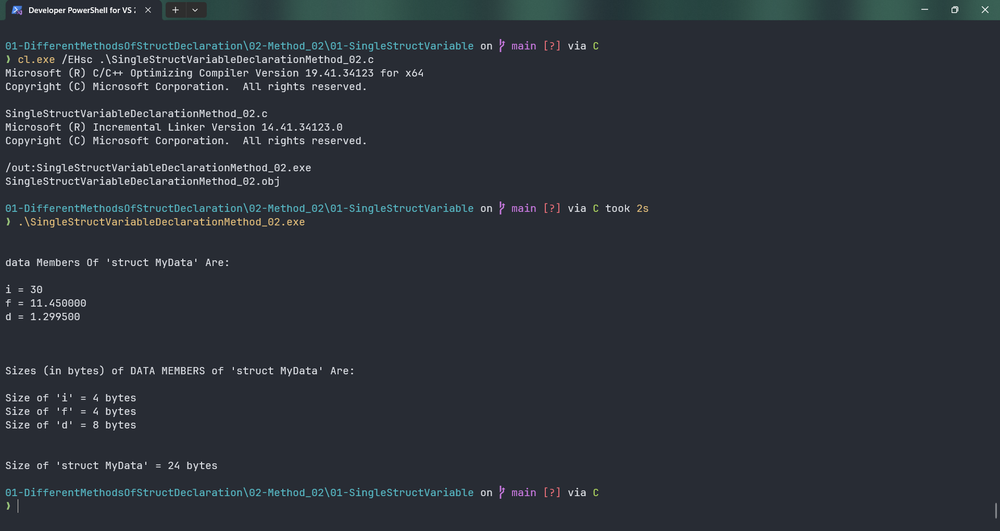

# SingleStructVariableDeclarationMethod_02

Submitted by Yash Pravin Pawar (RTR2024-023)

## Output Screenshots


## Code
### [SingleStructVariableDeclarationMethod_02.c](./01-Code/SingleStructVariableDeclarationMethod_02.c)
```c
#include <stdio.h>

struct MyData
{
    int i;
    float f;
    double d;
    char c;
};

struct MyData ypp_data;

int main(void)
{
    int ypp_i_size;
    int ypp_f_size;
    int ypp_d_size;
    int ypp_c_size;

    int ypp_struct_MyData_size;

    ypp_data.i = 30;
    ypp_data.f = 11.45f;
    ypp_data.d = 1.2995;

    printf("\n\n");
    printf("data Members Of 'struct MyData' Are: \n\n");
    printf("i = %d\n", ypp_data.i);
    printf("f = %f\n", ypp_data.f);
    printf("d = %lf\n\n", ypp_data.d);

    ypp_i_size = sizeof(ypp_data.i);
    ypp_f_size = sizeof(ypp_data.f);
    ypp_d_size = sizeof(ypp_data.d);

    printf("\n\n");
    printf("Sizes (in bytes) of DATA MEMBERS of 'struct MyData' Are: \n\n");

    printf("Size of 'i' = %d bytes\n", ypp_i_size);
    printf("Size of 'f' = %d bytes\n", ypp_f_size);
    printf("Size of 'd' = %d bytes\n", ypp_d_size);

    ypp_struct_MyData_size = sizeof(ypp_data);

    printf("\n\n");
    printf("Size of 'struct MyData' = %d bytes\n", ypp_struct_MyData_size);
}

```
