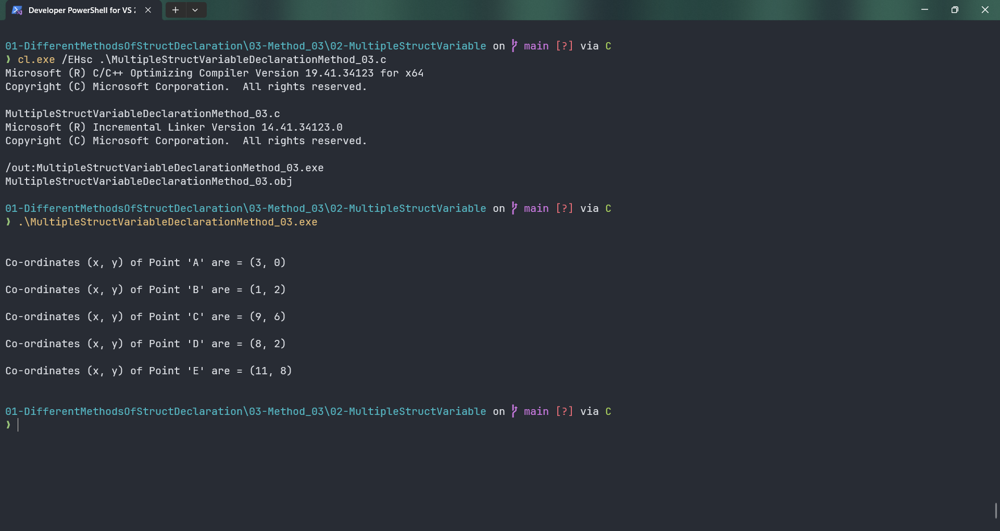

# MultipleStructVariableDeclarationMethod_03

Submitted by Yash Pravin Pawar (RTR2024-023)

## Output Screenshots


## Code
### [MultipleStructVariableDeclarationMethod_03.c](./01-Code/MultipleStructVariableDeclarationMethod_03.c)
```c
#include <stdio.h>

int main(void)
{
    struct MyPoint
    {
        int x;
        int y;
    } ypp_point_A, ypp_point_B, ypp_point_C, ypp_point_D, ypp_point_E;

    ypp_point_A.x = 3;
    ypp_point_A.y = 0;

    ypp_point_B.x = 1;
    ypp_point_B.y = 2;

    ypp_point_C.x = 9;
    ypp_point_C.y = 6;

    ypp_point_D.x = 8;
    ypp_point_D.y = 2;

    ypp_point_E.x = 11;
    ypp_point_E.y = 8;

    printf("\n\n");

    printf("Co-ordinates (x, y) of Point 'A' are = (%d, %d)\n\n", ypp_point_A.x, ypp_point_A.y);
    
    printf("Co-ordinates (x, y) of Point 'B' are = (%d, %d)\n\n", ypp_point_B.x, ypp_point_B.y);

    printf("Co-ordinates (x, y) of Point 'C' are = (%d, %d)\n\n", ypp_point_C.x, ypp_point_C.y);

    printf("Co-ordinates (x, y) of Point 'D' are = (%d, %d)\n\n", ypp_point_D.x, ypp_point_D.y);

    printf("Co-ordinates (x, y) of Point 'E' are = (%d, %d)\n\n", ypp_point_E.x, ypp_point_E.y);

    return (0);
}

```
