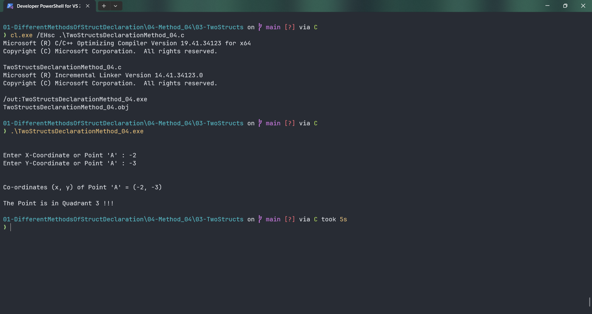

# TwoStructsDeclarationMethod_04

Submitted by Yash Pravin Pawar (RTR2024-023)

## Output Screenshots


## Code
### [TwoStructsDeclarationMethod_04.c](./01-Code/TwoStructsDeclarationMethod_04.c)
```c
#include <stdio.h>

struct MyPoint
{
    int x;
    int y;
};

struct MyPointProperties
{
    int quadrant;
    char axis_location[10];
};

int main(void)
{
    struct MyPoint ypp_point;
    struct MyPointProperties ypp_point_properties;

    printf("\n\n");
    printf("Enter X-Coordinate or Point 'A' : ");
    scanf("%d", &ypp_point.x);
    printf("Enter Y-Coordinate or Point 'A' : ");
    scanf("%d", &ypp_point.y);

    printf("\n\n");
    printf("Co-ordinates (x, y) of Point 'A' = (%d, %d)\n\n", ypp_point.x, ypp_point.y);

    if (ypp_point.x == 0 && ypp_point.y == 0)
        printf("The Point is the Origin (%d, %d) !!!\n", ypp_point.x, ypp_point.y);
    else
    {
        if (ypp_point.x == 0)
        {
            if (ypp_point.y < 0)
                strcpy(ypp_point_properties.axis_location, "Negative Y");
            else
                strcpy(ypp_point_properties.axis_location, "Positive Y");

            ypp_point_properties.quadrant = 0;
            printf("The Point is on the %s Axis !!!\n", ypp_point_properties.axis_location);
        }
        else if (ypp_point.y == 0)
        {
            if (ypp_point.x < 0)
                strcpy(ypp_point_properties.axis_location, "Negative X");
            else
                strcpy(ypp_point_properties.axis_location, "Positive X");

            ypp_point_properties.quadrant = 0;
            printf("The Point is on the %s Axis !!!\n", ypp_point_properties.axis_location);
        }
        else
        {
            ypp_point_properties.axis_location[0] = '\0';

            if (ypp_point.x > 0 && ypp_point.y > 0)
                ypp_point_properties.quadrant = 1;
            else if (ypp_point.x < 0 && ypp_point.y > 0)
                ypp_point_properties.quadrant = 2;
            else if (ypp_point.x < 0 && ypp_point.y < 0)
                ypp_point_properties.quadrant = 3;
            else
                ypp_point_properties.quadrant = 4;

            printf("The Point is in Quadrant %d !!!\n", ypp_point_properties.quadrant);
        }
    }

    return (0);
}

```
