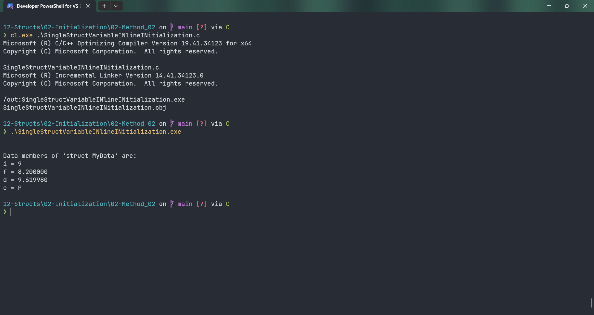

# SingleStructVariableINlineINitialization

Submitted by Yash Pravin Pawar (RTR2024-023)

## Output Screenshots


## Code
### [SingleStructVariableINlineINitialization.c](./01-Code/SingleStructVariableINlineINitialization.c)
```c
#include <stdio.h>

struct MyData
{
    int i;
    float f;
    double d;
    char c;
};

struct MyData ypp_data = { 9, 8.2f, 9.61998, 'P' };

int main(void)
{
    printf("\n\n");
    printf("Data members of 'struct MyData' are: \n");
    printf("i = %d\n", ypp_data.i);
    printf("f = %f\n", ypp_data.f);
    printf("d = %lf\n", ypp_data.d);
    printf("c = %c\n", ypp_data.c);

    return (0);
}

```
