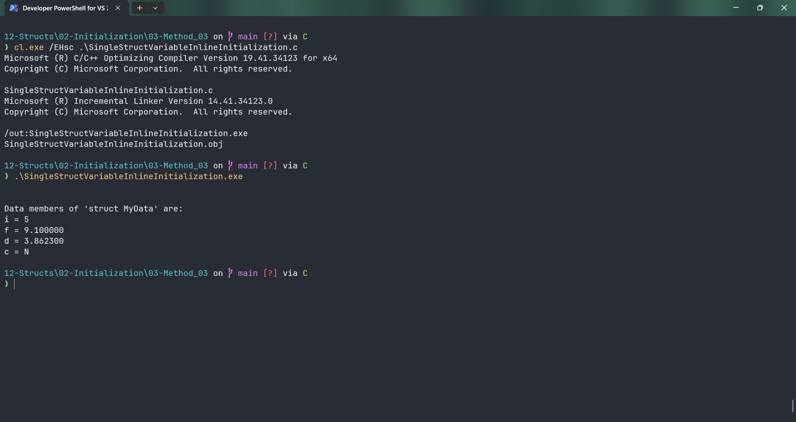

# SingleStructVariableInlineInitialization

Submitted by Yash Pravin Pawar (RTR2024-023)

## Output Screenshots


## Code
### [SingleStructVariableInlineInitialization.c](./01-Code/SingleStructVariableInlineInitialization.c)
```c
#include <stdio.h>

int main(void)
{
    struct MyData
    {
        int i;
        float f;
        double d;
        char c;
    } ypp_data = { 5, 9.1f, 3.86230, 'N' };
    
    printf("\n\n");
    printf("Data members of 'struct MyData' are: \n");
    printf("i = %d\n", ypp_data.i);
    printf("f = %f\n", ypp_data.f);
    printf("d = %lf\n", ypp_data.d);
    printf("c = %c\n", ypp_data.c);

    return (0);
}

```
