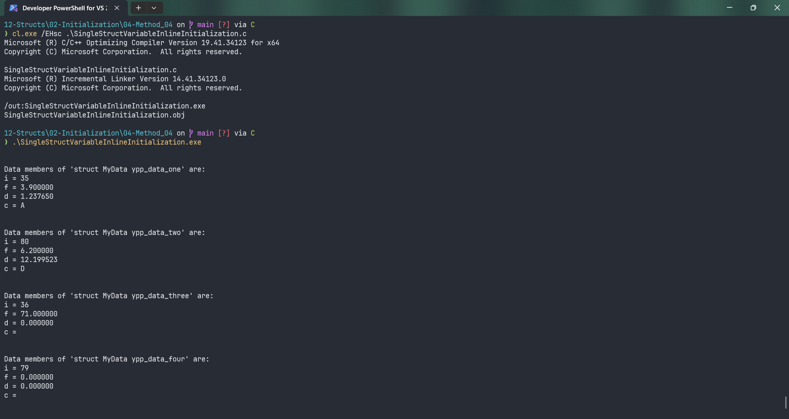

# SingleStructVariableInlineInitialization

Submitted by Yash Pravin Pawar (RTR2024-023)

## Output Screenshots


## Code
### [SingleStructVariableInlineInitialization.c](./01-Code/SingleStructVariableInlineInitialization.c)
```c
#include <stdio.h>

struct MyData
{
    int i;
    float f;
    double d;
    char c;
};

int main(void)
{
    struct MyData ypp_data_one = { 35, 3.9f, 1.23765, 'A' };

    struct MyData ypp_data_two = { 'P', 6.2f, 12.199523, 68 };

    struct MyData ypp_data_three = { 36, 'G' };

    struct MyData ypp_data_four = { 79 };

    printf("\n\n");
    printf("Data members of 'struct MyData ypp_data_one' are: \n");
    printf("i = %d\n", ypp_data_one.i);
    printf("f = %f\n", ypp_data_one.f);
    printf("d = %lf\n", ypp_data_one.d);
    printf("c = %c\n", ypp_data_one.c);

    printf("\n\n");
    printf("Data members of 'struct MyData ypp_data_two' are: \n");
    printf("i = %d\n", ypp_data_two.i);
    printf("f = %f\n", ypp_data_two.f);
    printf("d = %lf\n", ypp_data_two.d);
    printf("c = %c\n", ypp_data_two.c);

    printf("\n\n");
    printf("Data members of 'struct MyData ypp_data_three' are: \n");
    printf("i = %d\n", ypp_data_three.i);
    printf("f = %f\n", ypp_data_three.f);
    printf("d = %lf\n", ypp_data_three.d);
    printf("c = %c\n", ypp_data_three.c);

    printf("\n\n");
    printf("Data members of 'struct MyData ypp_data_four' are: \n");
    printf("i = %d\n", ypp_data_four.i);
    printf("f = %f\n", ypp_data_four.f);
    printf("d = %lf\n", ypp_data_four.d);
    printf("c = %c\n", ypp_data_four.c);

    return (0);
}

```
