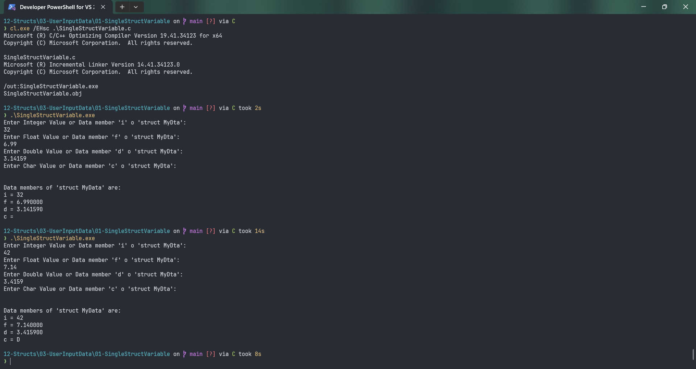

# SingleStructVariable

Submitted by Yash Pravin Pawar (RTR2024-023)

## Output Screenshots


## Code
### [SingleStructVariable.c](./01-Code/SingleStructVariable.c)
```c
#include <stdio.h>
#include <conio.h>

struct MyData
{
    int i;
    float f;
    double d;
    char c;
};

int main(void)
{
    struct MyData data;

    printf("Enter Integer Value or Data member 'i' o 'struct MyDta': \n");
    scanf("%d", &data.i);

    printf("Enter Float Value or Data member 'f' o 'struct MyDta': \n");
    scanf("%f", &data.f);

    printf("Enter Double Value or Data member 'd' o 'struct MyDta': \n");
    scanf("%lf", &data.d);


    printf("Enter Char Value or Data member 'c' o 'struct MyDta': \n");
    data.c = getch();

    printf("\n\nData members of 'struct MyData' are: \n");
    printf("i = %d\n", data.i);
    printf("f = %f\n", data.f);
    printf("d = %lf\n", data.d);
    printf("c = %c\n", data.c);

    return (0);
}

```
