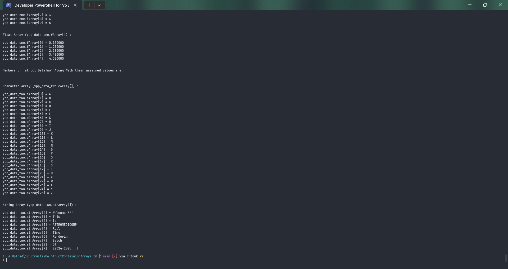
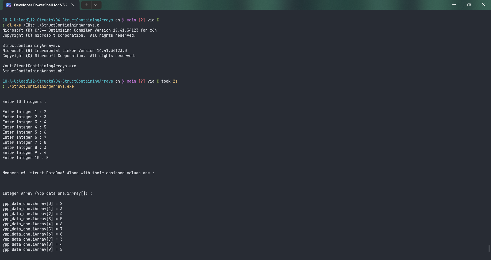

# StructContiainingArrays

Submitted by Yash Pravin Pawar (RTR2024-023)

## Output Screenshots



## Code
### [StructContiainingArrays.c](./01-Code/StructContiainingArrays.c)
```c
#include <stdio.h>

#define INT_ARRAY_SIZE 10
#define FLOAT_ARRAY_SIZE 5
#define CHAR_ARRAY_SIZE 26

#define NUM_STRINGS 10
#define MAX_CHARACTERS_PER_STRING 20

#define ALPHABET_BEGINNING 65

struct MyDataOne
{
    int iArray[INT_ARRAY_SIZE];
    float fArray[FLOAT_ARRAY_SIZE];
};

struct MyDataTwo
{
    char cArray[CHAR_ARRAY_SIZE];
    char strArray[NUM_STRINGS][MAX_CHARACTERS_PER_STRING];
};

int main(void)
{
    struct MyDataOne ypp_data_one;
    struct MyDataTwo ypp_data_two;

    int i;

    ypp_data_one.fArray[0] = 0.1f;
    ypp_data_one.fArray[1] = 1.2f;
    ypp_data_one.fArray[2] = 2.3f;
    ypp_data_one.fArray[3] = 3.4f;
    ypp_data_one.fArray[4] = 4.5f;

    printf("\n\n");
    printf("Enter %d Integers : \n\n", INT_ARRAY_SIZE);
    for (i = 0; i < INT_ARRAY_SIZE; i++)
    {
        printf("Enter Integer %d : ", i + 1);
        scanf("%d", &ypp_data_one.iArray[i]);
    }

    for (i = 0; i < CHAR_ARRAY_SIZE; i++)
        ypp_data_two.cArray[i] = (char) (ALPHABET_BEGINNING + i);
    
    strcpy(ypp_data_two.strArray[0], "Welcome !!!");
    strcpy(ypp_data_two.strArray[1], "This");
    strcpy(ypp_data_two.strArray[2], "Is");
    strcpy(ypp_data_two.strArray[3], "ASTROMEDICOMP");
    strcpy(ypp_data_two.strArray[4], "Real");
    strcpy(ypp_data_two.strArray[5], "Time");
    strcpy(ypp_data_two.strArray[6], "Rendering");
    strcpy(ypp_data_two.strArray[7], "Batch");
    strcpy(ypp_data_two.strArray[8], "Of");
    strcpy(ypp_data_two.strArray[9], "22024-2025 !!!");

    // displaying data members
    printf("\n\n");
    printf("Members of 'struct DataOne' Along With their assigned values are : \n\n");

    printf("\n\n");
    printf("Integer Array (ypp_data_one.iArray[]) : \n\n");
    for (i = 0; i < INT_ARRAY_SIZE; i++)
        printf("ypp_data_one.iArray[%d] = %d\n", i, ypp_data_one.iArray[i]);

    printf("\n\n");
    printf("Float Array (ypp_data_one.fArray[]) : \n\n");
    for (i = 0; i < FLOAT_ARRAY_SIZE; i++)
        printf("ypp_data_one.fArray[%d] = %f\n", i, ypp_data_one.fArray[i]);

    printf("\n\n");
    printf("Members of 'struct DataTwo' Along With their assigned values are : \n\n");

    printf("\n\n");
    printf("Character Array (ypp_data_two.cArray[]) : \n\n");
    for (i = 0; i < CHAR_ARRAY_SIZE; i++)
        printf("ypp_data_two.cArray[%d] = %c\n", i, ypp_data_two.cArray[i]);

    printf("\n\n");
    printf("String Array (ypp_data_two.strArray[]) : \n\n");
    for (i = 0; i < NUM_STRINGS; i++)
        printf("ypp_data_two.strArray[%d] = %s\n", i, ypp_data_two.strArray[i]);

    return (0);
}

```
