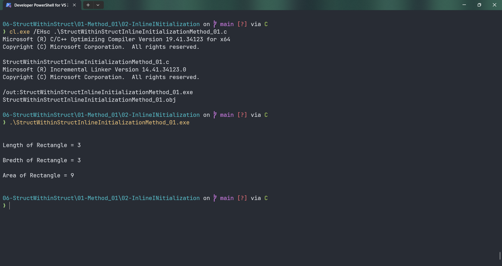

# StructWithinStructInlineInitializationMethod_01

Submitted by Yash Pravin Pawar (RTR2024-023)

## Output Screenshots


## Code
### [StructWithinStructInlineInitializationMethod_01.c](./01-Code/StructWithinStructInlineInitializationMethod_01.c)
```c
#include <stdio.h>

    struct Rectangle
    {
        struct MyPoint
        {
            int x;
            int y;
        } point_01, point_02;
    } ypp_rect = {{2, 3}, {5, 6}};

int main(void)
{
    int ypp_length, ypp_bredth, ypp_area;

    ypp_length = ypp_rect.point_02.y - ypp_rect.point_01.y;
    if (ypp_length < 0)
        ypp_length = -1*ypp_length;

    ypp_bredth = ypp_rect.point_02.x - ypp_rect.point_01.x;
    if (ypp_bredth < 0)
        ypp_bredth = -1*ypp_bredth;

    ypp_area = ypp_length * ypp_bredth;

    printf("\n\n");
    printf("Length of Rectangle = %d\n\n", ypp_length);
    printf("Bredth of Rectangle = %d\n\n", ypp_bredth);
    printf("Area of Rectangle = %d\n\n", ypp_area);

    return (0);
}
```
