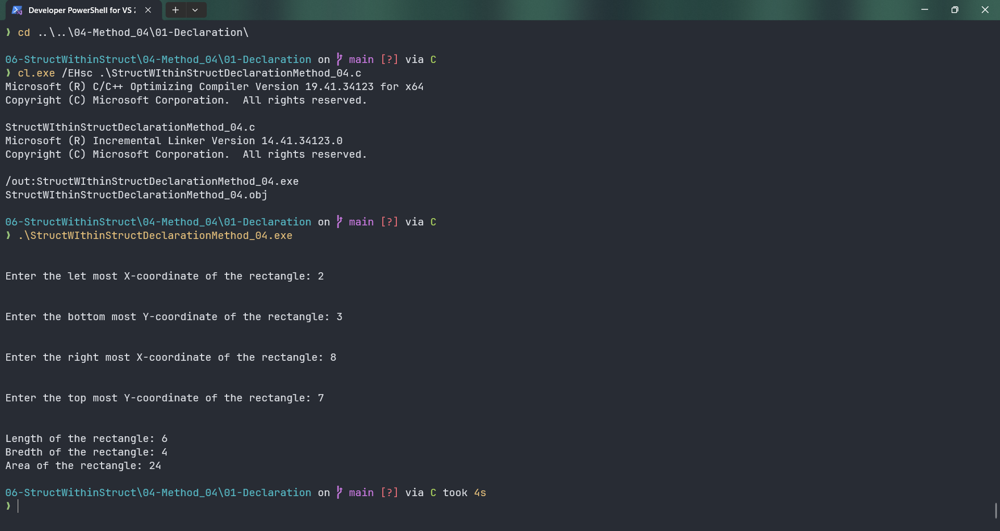

# StructWIthinStructDeclarationMethod_04

Submitted by Yash Pravin Pawar (RTR2024-023)

## Output Screenshots


## Code
### [StructWIthinStructDeclarationMethod_04.c](./01-Code/StructWIthinStructDeclarationMethod_04.c)
```c
#include <stdio.h>

int main(void)
{
    int ypp_length, ypp_bredth, ypp_area;

    struct MyPoint
    {
        int x;
        int y;
    };

    struct Rectangle
    {
        struct MyPoint point_01;
        struct MyPoint point_02;
    };

    struct Rectangle ypp_rect;

    printf("\n\n");
    printf("Enter the let most X-coordinate of the rectangle: ");
    scanf("%d", &ypp_rect.point_01.x);

    printf("\n\n");
    printf("Enter the bottom most Y-coordinate of the rectangle: ");
    scanf("%d", &ypp_rect.point_01.y);

    printf("\n\n");
    printf("Enter the right most X-coordinate of the rectangle: ");
    scanf("%d", &ypp_rect.point_02.x);

    printf("\n\n");
    printf("Enter the top most Y-coordinate of the rectangle: ");
    scanf("%d", &ypp_rect.point_02.y);

    ypp_length = ypp_rect.point_02.x - ypp_rect.point_01.x;
    if (ypp_length < 0)
    {
        ypp_length = -1 * ypp_length;
    }

    ypp_bredth = ypp_rect.point_02.y - ypp_rect.point_01.y;
    if (ypp_bredth < 0)
    {
        ypp_bredth = -1 * ypp_bredth;
    }

    ypp_area = ypp_length * ypp_bredth;

    printf("\n\n");
    printf("Length of the rectangle: %d\n", ypp_length);
    printf("Bredth of the rectangle: %d\n", ypp_bredth);
    printf("Area of the rectangle: %d\n", ypp_area);

    return (0);
}

```
