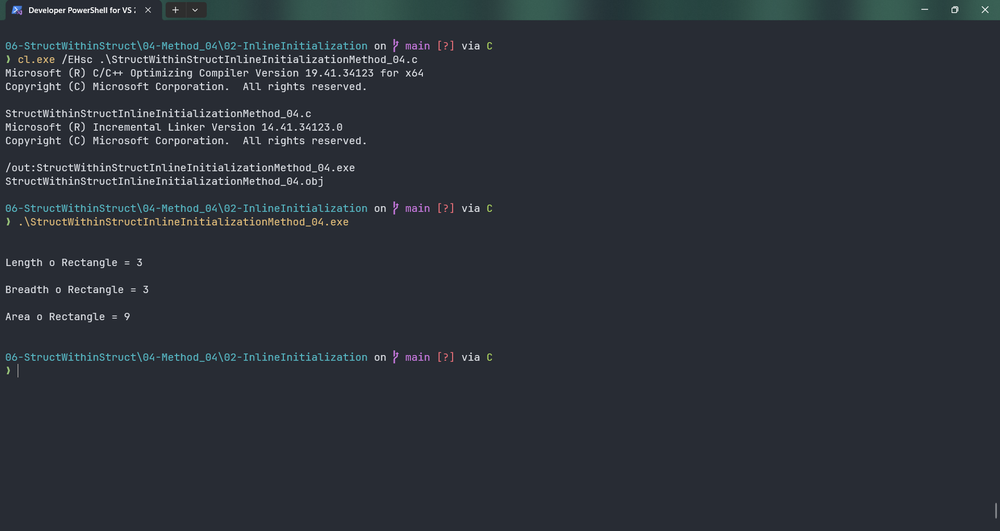

# StructWithinStructInlineInitializationMethod_04

Submitted by Yash Pravin Pawar (RTR2024-023)

## Output Screenshots


## Code
### [StructWithinStructInlineInitializationMethod_04.c](./01-Code/StructWithinStructInlineInitializationMethod_04.c)
```c
#include <stdio.h>

int main(void)
{
    int ypp_length, ypp_breadth, ypp_area;

    struct MyPoint
    {
        int x;
        int y;
    };

    struct Rectangle
    {
        struct MyPoint point_01;
        struct MyPoint point_02;
    };

    struct Rectangle rect = { { 2, 3 }, { 5, 6 } };

    // code
    ypp_length = rect.point_02.y - rect.point_01.y;
    if (ypp_length < 0)
        ypp_length = -1 * ypp_length;

    ypp_breadth = rect.point_02.x - rect.point_01.x;
    if (ypp_breadth < 0)
        ypp_breadth = -1 * ypp_breadth;

    ypp_area = ypp_length * ypp_breadth;

    printf("\n\n");
    printf("Length o Rectangle = %d\n\n", ypp_length);  
    printf("Breadth o Rectangle = %d\n\n", ypp_breadth);
    printf("Area o Rectangle = %d\n\n", ypp_area);

    return (0);
}

```
