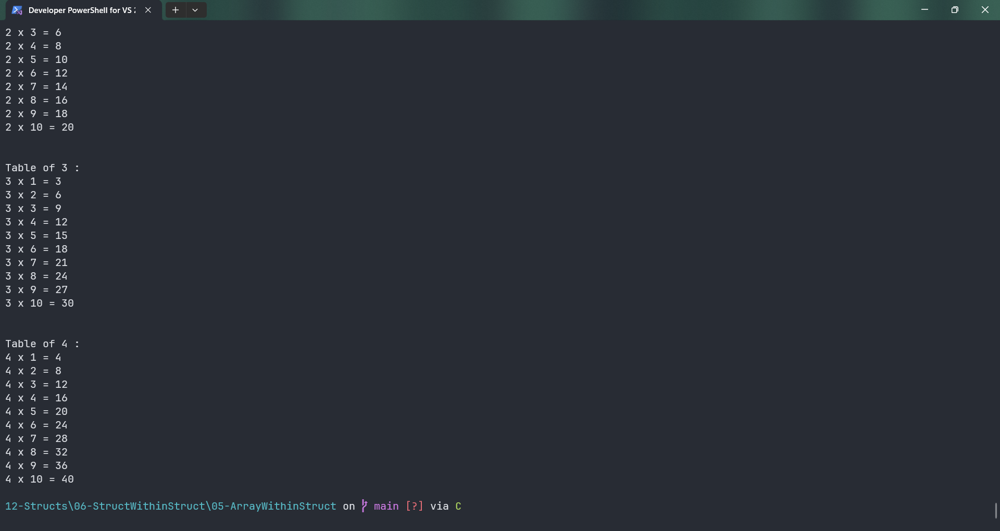
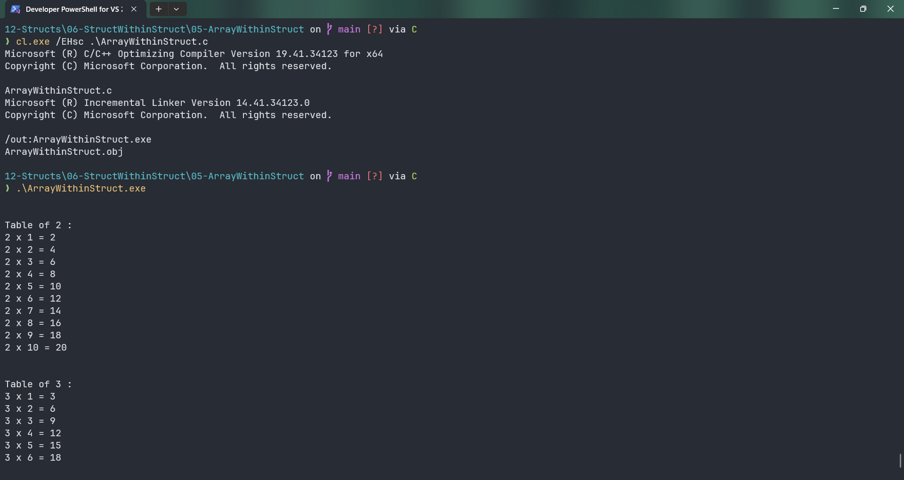

# ArrayWithinStruct

Submitted by Yash Pravin Pawar (RTR2024-023)

## Output Screenshots



## Code
### [ArrayWithinStruct.c](./01-Code/ArrayWithinStruct.c)
```c
#include <stdio.h>

struct MyNumber
{
    int num;
    int num_table[10];
};

struct NumTables
{
    struct MyNumber a;
    struct MyNumber b;
    struct MyNumber c;
};

int main(void)
{
    struct NumTables tables;

    int i;

    // code
    tables.a.num = 2;

    for (i = 0; i < 10; i++)
    {
        tables.a.num_table[i] = tables.a.num * (i + 1);
    }

    printf("\n\n");
    printf("Table of %d : \n", tables.a.num);
    for (i = 0; i < 10; i++)
    {
        printf("%d x %d = %d\n", tables.a.num, i + 1, tables.a.num_table[i]);
    }

    tables.b.num = 3;
    for (i = 0; i < 10; i++)
    {
        tables.b.num_table[i] = tables.b.num * (i + 1);
    }

    printf("\n\n");
    printf("Table of %d : \n", tables.b.num);
    for (i = 0; i < 10; i++)
    {
        printf("%d x %d = %d\n", tables.b.num, i + 1, tables.b.num_table[i]);
    }

    tables.c.num = 4;
    for (i = 0; i < 10; i++)
    {
        tables.c.num_table[i] = tables.c.num * (i + 1);
    }

    printf("\n\n");
    printf("Table of %d : \n", tables.c.num);
    for (i = 0; i < 10; i++)
    {
        printf("%d x %d = %d\n", tables.c.num, i + 1, tables.c.num_table[i]);
    }

    return (0);
}

```
