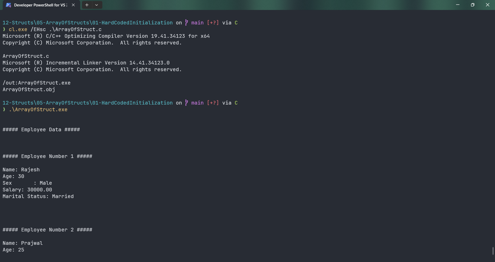

# ArrayOfStruct

Submitted by Yash Pravin Pawar (RTR2024-023)

## Output Screenshots



## Code
### [ArrayOfStruct.c](./01-Code/ArrayOfStruct.c)
```c
#include <stdio.h>

#define NAME_LENGTH 100
#define MARITAL_STATUS 10

struct Employee
{
    char name[NAME_LENGTH];
    int age;
    float salary;
    char sex;
    char marital_status[MARITAL_STATUS];
};

int main(void)
{
    struct Employee ypp_EmployeeRecords[5];

    char employee_rajesh[] = "Rajesh";
    char employee_prajwal[] = "Prajwal";
    char employee_suresh[] = "Suresh";
    char employee_mahesh[] = "Mahesh";
    char employee_ramesh[] = "Ramesh";

    int i;

    // hard coded initialization
    strcpy(ypp_EmployeeRecords[0].name, employee_rajesh);
    ypp_EmployeeRecords[0].age = 30;
    ypp_EmployeeRecords[0].salary = 30000.0f;
    ypp_EmployeeRecords[0].sex = 'M';
    strcpy(ypp_EmployeeRecords[0].marital_status, "Married");

    strcpy(ypp_EmployeeRecords[1].name, employee_prajwal);
    ypp_EmployeeRecords[1].age = 25;
    ypp_EmployeeRecords[1].salary = 25000.0f;
    ypp_EmployeeRecords[1].sex = 'M';
    strcpy(ypp_EmployeeRecords[1].marital_status, "Unmarried");

    strcpy(ypp_EmployeeRecords[2].name, employee_suresh);
    ypp_EmployeeRecords[2].age = 35;
    ypp_EmployeeRecords[2].salary = 35000.0f;
    ypp_EmployeeRecords[2].sex = 'M';
    strcpy(ypp_EmployeeRecords[2].marital_status, "Married");

    strcpy(ypp_EmployeeRecords[3].name, employee_mahesh);
    ypp_EmployeeRecords[3].age = 40;
    ypp_EmployeeRecords[3].salary = 40000.0f;
    ypp_EmployeeRecords[3].sex = 'M';
    strcpy(ypp_EmployeeRecords[3].marital_status, "Married");

    strcpy(ypp_EmployeeRecords[4].name, employee_ramesh);
    ypp_EmployeeRecords[4].age = 45;
    ypp_EmployeeRecords[4].salary = 45000.0f;
    ypp_EmployeeRecords[4].sex = 'M';
    strcpy(ypp_EmployeeRecords[4].marital_status, "Married");

    // display the data
    printf("\n\n");
    printf("##### Employee Data #####\n\n");
    for (i = 0; i < 5; i++)
    {
        printf("\n\n");
        printf("##### Employee Number %d #####\n\n", (i + 1));
        printf("Name: %s\n", ypp_EmployeeRecords[i].name);
        printf("Age: %d\n", ypp_EmployeeRecords[i].age);

        if (ypp_EmployeeRecords[i].sex == 'M' || ypp_EmployeeRecords[i].sex == 'm')
        {
            printf("Sex       : Male\n");
        }
        else 
        {
            printf("Sex       : Female\n");
        }

        printf("Salary: %.2f\n", ypp_EmployeeRecords[i].salary);
        printf("Marital Status: %s\n", ypp_EmployeeRecords[i].marital_status);

        printf("\n\n");
    }

    return (0);
}

```
