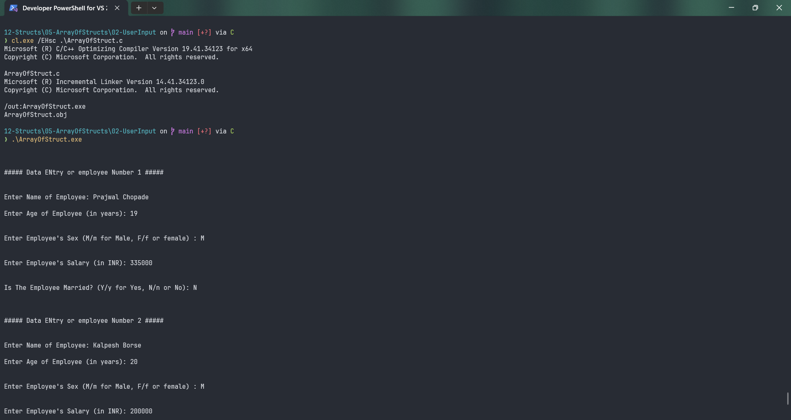

# ArrayOfStruct

Submitted by Yash Pravin Pawar (RTR2024-023)

## Output Screenshots




## Code
### [ArrayOfStruct.c](./01-Code/ArrayOfStruct.c)
```c
#include <stdio.h>
#include <ctype.h>

#define NUM_EMPLOYEES 5

#define NAME_LENGTH 100
#define MARITAL_STATUS 10

struct Employee
{
    char name[NAME_LENGTH];
    int age;
    char sex;
    char marital_status;
    float salary;
};

int main(void)
{
    void MyGetString(char[], int);

    struct Employee ypp_employee_records[NUM_EMPLOYEES];
    int i;

    for (i = 0; i < NUM_EMPLOYEES; i++)
    {
        printf("\n\n\n");
        printf("##### Data ENtry or employee Number %d #####\n", (i + 1));

        printf("\n\n");
        printf("Enter Name of Employee: ");
        MyGetString(ypp_employee_records[i].name, NAME_LENGTH);

        printf("\n\n");
        printf("Enter Age of Employee (in years): ");
        scanf("%d", &ypp_employee_records[i].age);

        printf("\n\n");
        printf("Enter Employee's Sex (M/m for Male, F/f or female) : ");
        ypp_employee_records[i].sex = toupper(getch());
        printf("%c\n", ypp_employee_records[i].sex);

        printf("\n\n");
        printf("Enter Employee's Salary (in INR): ");
        scanf("%f", &ypp_employee_records[i].salary);

        printf("\n\n");
        printf("Is The Employee Married? (Y/y for Yes, N/n or No): ");
        ypp_employee_records[i].marital_status = toupper(getch());
        printf("%c\n", ypp_employee_records[i].marital_status);
    }

    // display the data
    printf("\n\n");
    printf("##### Employee Data #####\n\n");
    for (i = 0; i < NUM_EMPLOYEES; i++)
    {
        printf("\n\n");
        printf("##### Employee Number %d #####\n\n", (i + 1));
        printf("Name: %s\n", ypp_employee_records[i].name);
        printf("Age: %d\n", ypp_employee_records[i].age);
        
        if (ypp_employee_records[i].sex == 'M')
        {
            printf("Sex          : Male\n");
        }
        else if (ypp_employee_records[i].sex == 'F')
        {
            printf("Sex          : Female\n");
        }
        else
        {
            printf("Sex          : Invalid Data Entered\n");
        }

        printf("Salary: %.2f\n", ypp_employee_records[i].salary);

        if (ypp_employee_records[i].marital_status == 'Y')
        {
            printf("Marital Status: Married\n");
        }
        else if (ypp_employee_records[i].marital_status == 'N')
        {
            printf("Marital Status: Single\n");
        }
        else
        {
            printf("Marital Status: Invalid Data Entered\n");
        }

        printf("\n\n");
    }

    return (0);
}

void MyGetString(char str[], int str_size)
{
    int i = 0;
    char ch;

    do {
        ch = getch();
        str[i] = ch;
        printf("%c", str[i]);
        i++;
    } while ((ch != '\r') && (i < (str_size)));

    if (i == str_size)
    {
        str[i - 1] = '\0';
    }
    else
    {
        str[i] = '\0';
    }
}

```
