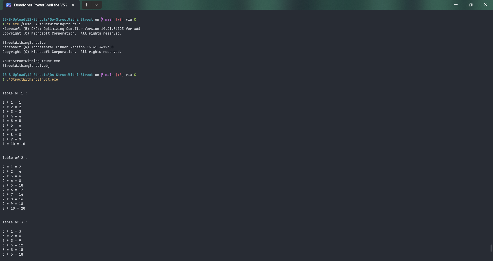

# StructWithingStruct

Submitted by Yash Pravin Pawar (RTR2024-023)

## Output Screenshots



## Code
### [StructWithingStruct.c](./01-Code/StructWithingStruct.c)
```c
#include <stdio.h>

struct MyNumber
{
    int num;
    int num_table[10];
};

struct NumTables
{
    struct MyNumber n;
};

int main(void)
{
    struct NumTables ypp_tables[10];
    int i, j;

    // code
    for (i = 0; i < 10; i++)
    {
        ypp_tables[i].n.num = (i + 1);
    }

    for (i = 0; i < 10; i++)
    {
        printf("\n\n");
        printf("Table of %d : \n\n", ypp_tables[i].n.num);

        for (j = 0; j < 10; j++)
        {
            ypp_tables[i].n.num_table[j] = ypp_tables[i].n.num * (j + 1);

            printf("%d * %d = %d\n", ypp_tables[i].n.num, (j + 1), ypp_tables[i].n.num_table[j]);
        }
    }

    return (0);
}

```
