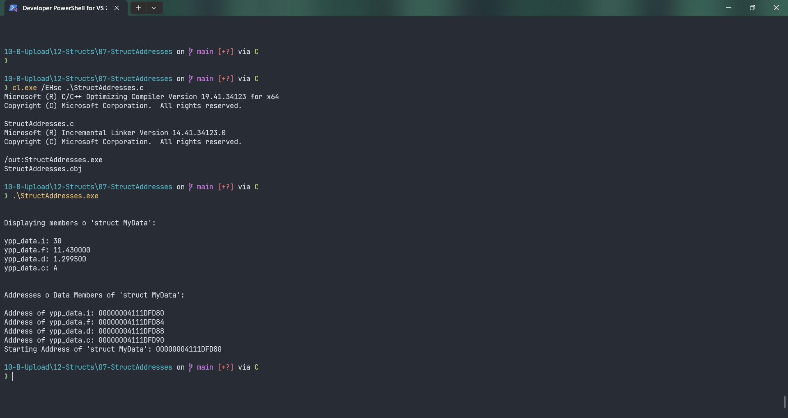

# StructAddresses

Submitted by Yash Pravin Pawar (RTR2024-023)

## Output Screenshots


## Code
### [StructAddresses.c](./01-Code/StructAddresses.c)
```c
#include <stdio.h>

struct MyData
{
    int i;
    float f;
    double d;
    char c;
};

int main(void)
{
    struct MyData ypp_data;

    ypp_data.i = 30;
    ypp_data.f = 11.43f;
    ypp_data.d = 1.2995;
    ypp_data.c = 'A';

    printf("\n\n");
    printf("Displaying members o 'struct MyData': \n\n");
    printf("ypp_data.i: %d\n", ypp_data.i);
    printf("ypp_data.f: %f\n", ypp_data.f);
    printf("ypp_data.d: %f\n", ypp_data.d);
    printf("ypp_data.c: %c\n", ypp_data.c);

    printf("\n\n");
    printf("Addresses o Data Members of 'struct MyData': \n\n");
    printf("Address of ypp_data.i: %p\n", &ypp_data.i);
    printf("Address of ypp_data.f: %p\n", &ypp_data.f);
    printf("Address of ypp_data.d: %p\n", &ypp_data.d);
    printf("Address of ypp_data.c: %p\n", &ypp_data.c);

    printf("Starting Address of 'struct MyData': %p\n", &ypp_data);

    return (0);
}

```
