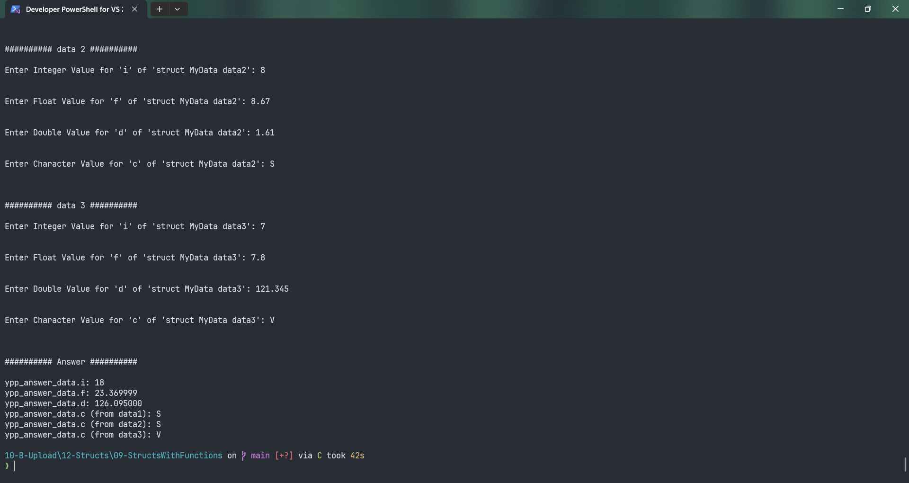
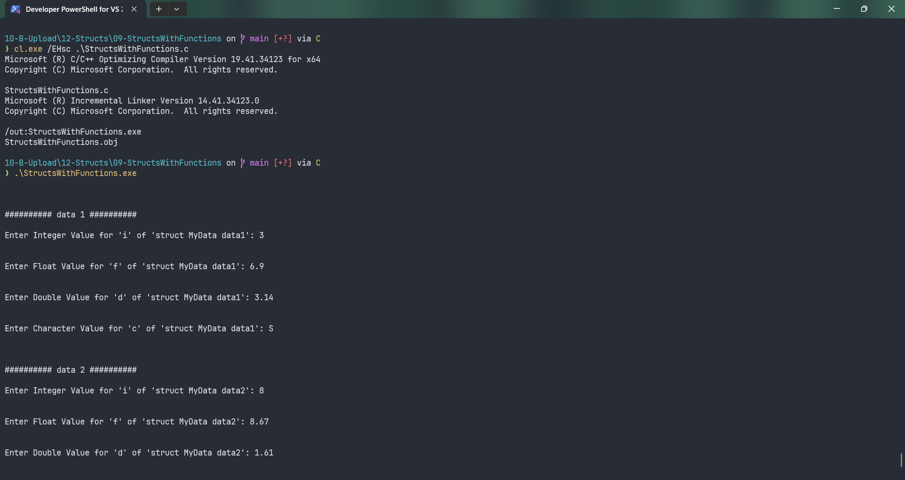

# StructsWithFunctions

Submitted by Yash Pravin Pawar (RTR2024-023)

## Output Screenshots



## Code
### [StructsWithFunctions.c](./01-Code/StructsWithFunctions.c)
```c
#include <stdio.h>

struct MyData
{
    int i;
    float f;
    double d;
    char c;
};

int main(void)
{
    struct MyData AddStructMembers(struct MyData, struct MyData, struct MyData);

    struct MyData ypp_data1, ypp_data2, ypp_data3, ypp_answer_data;

    // input data rom user
    printf("\n\n\n");
    printf("########## data 1 ##########\n\n");
    printf("Enter Integer Value for 'i' of 'struct MyData data1': ");
    scanf("%d", &ypp_data1.i);

    printf("\n\nEnter Float Value for 'f' of 'struct MyData data1': ");
    scanf("%f", &ypp_data1.f);

    printf("\n\nEnter Double Value for 'd' of 'struct MyData data1': ");
    scanf("%lf", &ypp_data1.d);

    printf("\n\nEnter Character Value for 'c' of 'struct MyData data1': ");
    scanf(" %c", &ypp_data1.c);


    printf("\n\n\n");
    printf("########## data 2 ##########\n\n");
    printf("Enter Integer Value for 'i' of 'struct MyData data2': ");
    scanf("%d", &ypp_data2.i);

    printf("\n\nEnter Float Value for 'f' of 'struct MyData data2': ");
    scanf("%f", &ypp_data2.f);

    printf("\n\nEnter Double Value for 'd' of 'struct MyData data2': ");
    scanf("%lf", &ypp_data2.d);

    printf("\n\nEnter Character Value for 'c' of 'struct MyData data2': ");
    scanf(" %c", &ypp_data2.c);


    printf("\n\n\n");
    printf("########## data 3 ##########\n\n");

    printf("Enter Integer Value for 'i' of 'struct MyData data3': ");
    scanf("%d", &ypp_data3.i);

    printf("\n\nEnter Float Value for 'f' of 'struct MyData data3': ");
    scanf("%f", &ypp_data3.f);

    printf("\n\nEnter Double Value for 'd' of 'struct MyData data3': ");
    scanf("%lf", &ypp_data3.d);

    printf("\n\nEnter Character Value for 'c' of 'struct MyData data3': ");
    scanf(" %c", &ypp_data3.c);

    ypp_answer_data = AddStructMembers(ypp_data1, ypp_data2, ypp_data3);

    printf("\n\n\n");
    printf("########## Answer ##########\n\n");
    printf("ypp_answer_data.i: %d\n", ypp_answer_data.i);
    printf("ypp_answer_data.f: %f\n", ypp_answer_data.f);
    printf("ypp_answer_data.d: %lf\n", ypp_answer_data.d);

    ypp_answer_data.c = ypp_data1.c;
    printf("ypp_answer_data.c (from data1): %c\n", ypp_answer_data.c);

    ypp_answer_data.c = ypp_data2.c;
    printf("ypp_answer_data.c (from data2): %c\n", ypp_answer_data.c);

    ypp_answer_data.c = ypp_data3.c;
    printf("ypp_answer_data.c (from data3): %c\n", ypp_answer_data.c);

    return (0);
}

struct MyData AddStructMembers(struct MyData data1, struct MyData data2, struct MyData data3)
{
    struct MyData ypp_data;

    ypp_data.i = data1.i + data2.i + data3.i;
    ypp_data.f = data1.f + data2.f + data3.f;
    ypp_data.d = data1.d + data2.d + data3.d;

    return (ypp_data);
}

```
